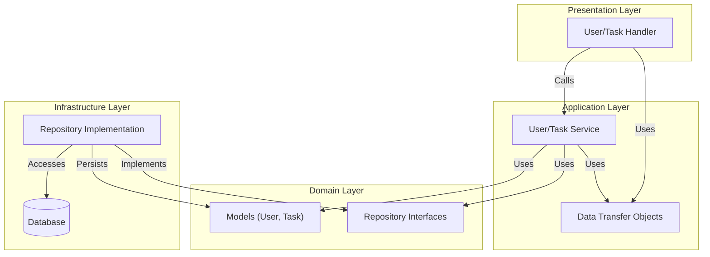

**3行まとめ**

* GoのDDD実装における`main.go`の肥大化問題を、DIライブラリ`uber-fx`で解決します。
* `fx.Module`や`fx.Private`を活用し、コンテキスト境界を保ったままレイヤー間を疎結合に配線する手法を解説します。
* ライフサイクル管理によるGraceful Shutdownや、`fx.Replace`を用いたテスト時の依存差し替え戦略も紹介します。

## 1. はじめに：なぜDDDの実装にDIライブラリが必要なのか

Goでドメイン駆動設計（DDD）やクリーンアーキテクチャを採用すると、レイヤー間の依存関係はきれいに整理され、テスタビリティが向上します。しかしその反面、main.go における構造体の初期化と依存注入（DI）のコードは急速に肥大化し、複雑になりがちです。

本記事では、DIライブラリである uber-go/fx を活用し、Goの構造体定義を汚さずに、テスト容易性を保ったままDDDのレイヤー構造をきれいに分離・配線する実践的な手法を紹介します。

<https://github.com/uber-go/fx>

実装のサンプルコードは以下のリポジトリで公開しています。

<https://github.com/haru-256/blog-ddd-uber-fx>

## 2. なぜuber-fxなのか：手動DIとの比較

DDDの実装において、なぜDIライブラリ、特に uber-fx を採用するのかを明確にするために、まずはライブラリを使わない場合と比較してみましょう。

### 手動DIの課題

Goでは「DIコンテナを使わず、main関数で手動で組み立てるのがシンプルで良い」という意見もあります。小規模なアプリケーションであれば、それが最適解であることも多いです。
しかし、DDDのようにレイヤーが多層化し、コンポーネント数が増えると、`main.go` は次のような初期化ボイラープレートの塊と化します。

```go
// 手動DIの例（プロジェクトが育つにつれて管理が困難になる）
func main() {
    // 1. Infrastructure層の初期化
    // 依存順序を意識した初期化が必要
    dbConn := db.NewDatabase()
    // Loggerは多くの場所で必要になるため、初期段階で作ります
    logger := logger.NewLogger()

    // LoggerやDBをバケツリレーのように引き回す必要があります
    userRepo := db.NewUserRepositoryImpl(logger, dbConn)
    taskRepo := db.NewTaskRepositoryImpl(logger, dbConn)

    // 2. Application層の初期化
    // Service層でもLoggerが必要なら、また渡さなければなりません
    userService := service.NewUserServiceImpl(logger, userRepo)
    taskService := service.NewTaskServiceImpl(logger, taskRepo)

    // 3. Presentation層の初期化
    // 引数が増えるたびにここの修正が発生します
    userHandler := server.NewUserServiceHandler(logger, userService)
    taskHandler := server.NewTaskServiceHandler(logger, taskService)

    // 4. サーバーの起動
    srv := server.NewServiceServer(userHandler, taskHandler)
    srv.Run()
}
```

このアプローチには、運用規模が大きくなるにつれて以下の課題が発生します。

* **依存順序の管理**: 「Aを作るにはBが必要だから、先にBを作らないと...」という依存関係のパズルを手動で解き続ける必要があります。
* **共通コンポーネントの引き回し**: Logger、Config、Tracerなど、アプリ全体で使うコンポーネントを末端のRepositoryまで届けるために、中間層のすべてのコンストラクタを経由してバケツリレーする必要があります。
* **修正コスト**: あるServiceの依存が1つ増えただけで、main.go の初期化フロー全体を見直す必要が出てきます。

### uber-fx を導入するとどうなるか

uber-fx を導入すると、上記の手続き的なコードは、「何を使うか（依存の定義）」 を宣言するだけのスタイルに変わります。

```go
// uber-fx の例
func main() {
    fx.New(
        // コンストラクタを「登録」するだけ。順番は気にしなくて良い
        fx.Provide(
            db.NewDatabase,
            logger.NewLogger,           // Logger も登録するだけ
            db.NewUserRepositoryImpl,   // fx が自動で引数(*Database, Logger)を解決して注入
            service.NewUserServiceImpl, // fx が自動で引数(Repo, Logger)を解決して注入
            server.NewUserServiceHandler,
        ),
        // 起動時のエントリーポイント
        fx.Invoke(func(srv *server.ServiceServer) {
            srv.Run()
        }),
    ).Run()
}
```

`fx.Provide` はコンストラクタの引数の型から必要なインスタンスを自動で解決し、注入してくれます。依存関係のグラフをライブラリが構築するため、手動で初期化順序を管理する必要がありません。

### uber-fx を選ぶ3つのメリット

1. **自動的な依存解決**: コンストラクタの引数の型から必要なインスタンスを推論し、自動で注入してくれます。
2. **モジュール化**: 機能やレイヤーごとにDI設定を `fx.Module` として切り出すことができ、コンテキスト境界をコード上で表現しやすくなります。
3. **統一的なライフサイクル管理**: アプリケーションの開始時（OnStart）と終了時（OnStop）のフック機能により、Graceful ShutdownやリソースクリーンアップをDI管理下で実現できます。

本記事では、この uber-fx を用いて、DDDの各レイヤーをどのように疎結合に保ちつつ、効率的に配線していくかを解説します。

## 3. 前提となるアーキテクチャとディレクトリ構成

具体的な実装解説に入る前に、本記事で扱うアプリケーションのレイヤー構造を共有します。uber-fx は、プロジェクトのディレクトリ構成に合わせて `fx.Module` を定義することで、真価を発揮します。

本記事では、以下のような標準的なGoのDDDプロジェクト構成を想定しています。依存の向きは `Presentation` → `Application` → `Infrastructure` → `Domain` のように、外側から内側へと一方向に流れます。`Infrastructure` 層は `Domain` 層で定義されたインターフェースを実装し、DIコンテナによって上位層に注入されます。

```sh
internal/
├── domain/         # エンティティ、リポジトリインターフェース
├── application/    # アプリケーションサービス、DTO
├── infrastructure/ # リポジトリ実装、DB、Logger
└── presentation/   # HTTPハンドラー、サーバー設定
```

各層の関係図は以下のとおりです。



## 4. uber-fxの仕組み

実践の前に、uber-fxの仕組みに触れておきます。
`fx.Provide` に関数を渡すだけで、自動的に依存関係が解決されますが、裏側では以下のステップで処理が行われています。

### Step 1: 型情報の解析 (Reflection)

`fx.Provide` に渡されたコンストラクタ関数の「引数の型」と「戻り値の型」を解析します。

```go
func NewUserService(repo UserRepository) *UserService { ... }
```

この関数を登録すると、uber-fx は「`UserRepository` を入力とし、`*UserService` を出力する」定義として認識します。

### Step 2: 依存グラフの構築

`fx.New(...)` が呼ばれた段階で、登録されたすべてのコンストラクタの情報を元に、依存グラフを作成します。

1. `*UserService` には `UserRepository` が必要
2. `UserRepository` は `NewUserRepository` から提供される
3. `NewUserRepository` には `*Database` が必要

このようにパズルを組み合わせるように依存関係を構築します。必要な型が見つからない場合や循環参照がある場合は、起動前にエラーとして報告されます。

### Step 3: トポロジカルソートと遅延初期化

依存グラフができあがると、uber-fx は依存関係の順序に従ってコンストラクタを呼び出す順番を決定します。
`fx.Provide` に書いた順番に関わらず、依存関係に基づいて「Infrastructure -> Application -> Presentation」のような正しい順序で実行されます。

### Step 4: ライフサイクルの実行

`Run()` メソッドが呼ばれると、以下のライフサイクルが実行されます。`OnStart`と`OnStop`を利用したGraceful Shutdownの例は、最後に示します。

* **初期化**: 依存グラフの順序に従ってコンストラクタを順次実行し、インスタンスを生成・注入します。
* **OnStart**: 全ての初期化が終わったら、登録された `OnStart` フック（サーバーのListen開始など）を実行します。
* **待機**: OSからのシグナル（Ctrl+Cなど）を待ちます。
* **OnStop**: シグナルを受け取ると、`OnStart` とは逆の順序で `OnStop` フック（DB切断、サーバー停止など）を実行し、安全に終了します。

---

ここからは、具体的なDDDの実装パターンを見ていきましょう。

## 5. 実践①：fx.Moduleによる「コンテキスト境界」の定義

DDDの実装において非常に便利なのが `fx.Module` です。これを使用することで、機能やレイヤーごとにDI設定をグループ化できます。

例えば、infrastructure パッケージで「DB接続」と「リポジトリの実装」を提供する場合を考えてみましょう。

```go
// internal/infrastructure/module.go (Step 1: 基本形)
var Module = fx.Module(
    "infrastructure",
    fx.Provide(
        // コンストラクタ関数を登録する
        db.NewDatabase,           // func NewDatabase() *Database
        db.NewUserRepositoryImpl, // func NewUserRepositoryImpl(db *Database) *UserRepositoryImpl
    ),
)
```

これを `main.go` で読み込むだけで、モジュール単位での合成が可能になります。

```go
// cmd/server/main.go
func main() {
    app := fx.New(
        infrastructure.Module, // インフラ層
        application.Module,    // アプリ層
        presentation.Module,   // プレゼンテーション層
    )
    app.Run()
}
```

ここで重要なのは、モジュール間の依存関係もコードで表現できる点です。
今回は presentation が application を、application が infrastructure を利用する階層構造になっています。これをモジュール定義に反映させます。

```go
// internal/presentation/module.go
var Module = fx.Module(
    "presentation",
    application.Module, // アプリケーション層を取り込む（インフラ層は直接知らない）
    fx.Provide(
        server.NewUserServiceHandler,
    ),
)
```

```go
// internal/application/module.go
var Module = fx.Module(
    "application",
    infrastructure.Module, // インフラ層を取り込む
    fx.Provide(
        service.NewUserServiceImpl,
    ),
)
```

このようにすることで、上位レイヤーは下位レイヤーのモジュールを内包し、main.go の記述をさらにシンプルに保つことができます。
例えば、今回は、`presentation`モジュールが`application`モジュールを、`application`モジュールが`infrastructure`モジュールを取り込む構成にしています。これにより、`main.go`では`presentation`モジュールのみを読み込むだけで済みます。

## 6. 実践②：fx.Annotateによる「インターフェース注入」

実践①のように、単純に `fx.Provide` を使うだけでは、DDD の依存関係の原則に問題が生じます。
`NewUserRepositoryImpl` は具体的な構造体（`*UserRepositoryImpl`）を返すため、これをそのまま登録すると、Application 層が Infrastructure 層の具象型に直接依存してしまいます。これは依存性逆転の原則（DIP）に違反しています。
本来、Application 層は Domain 層で定義されたインターフェース（`domain.UserRepository`）にのみ依存すべきです。

「コンストラクタの戻り値をインターフェースに変更すれば良いのでは？」と考えるかもしれませんが、Goには **"Accept interfaces, return structs"**（インターフェースを受け取り、構造体を返す）というベストプラクティスがあります。
コンストラクタがインターフェースを返してしまうと、実装の詳細が過度に隠蔽されて柔軟性が失われ、呼び出し側が「必要なメソッドだけの最小限のインターフェース」を定義する自由度が損なわれます。

そこで役立つのが `fx.Annotate` と `fx.As` です。
これらを使うと、**「コンストラクタは構造体を返す」というGoの流儀を維持したまま、DIコンテナへの登録時だけインターフェースとして振り舞わせる** ことができます。

```go
// internal/infrastructure/module.go (Step 2: インターフェースとして登録)
var Module = fx.Module(
    "infrastructure",
    fx.Provide(
        db.NewDatabase,

        // "構造体" を返すコンストラクタを、"インターフェース" のProviderとして登録
        fx.Annotate(
            db.NewUserRepositoryImpl,
            fx.As(new(domain.UserRepository)),
        ),
    ),
)
```

これにより、実装コードを汚すことなく、きれいな依存関係逆転（DIP）を実現できます。

## 7. 実践③：fx.Privateによる「カプセル化の強制」

さらに改善を進めます。`db.NewDatabase` で生成される DB インスタンスは、Infrastructure 層内部（リポジトリ実装）でのみ必要で、Domain 層や Application 層から直接アクセスされるべきではありません。

`fx.Private` を使うと、その Module 内でのみ依存を利用可能にし、外部への露出を防ぐことができます。

```go
// internal/infrastructure/module.go (Step 3: カプセル化)
var Module = fx.Module(
    "infrastructure",
    fx.Provide(
        // 公開するコンポーネント
        fx.Annotate(
            db.NewUserRepositoryImpl,
            fx.As(new(domain.UserRepository)),
        ),
    ),
    // 内部でのみ使用するコンポーネント
    fx.Provide(
        db.NewDatabase,
        fx.Private, // <--- このモジュール外からは見えなくなる
    ),
)
```

これにより、ドメインロジック内で誤って生の DB 接続にアクセスするといったアーキテクチャ違反を、起動時に防ぐことができます。
例えば、Application 層から `db.NewDatabase` の返り値を引数に取るコンポーネントを `fx.Provide` に登録しても、依存値が見つからずアプリケーション起動時にエラーが報告されます。

## 8. 実践④：設定値の注入とタグ (`fx.Supply`)

ここまでは構造体の依存解決について説明しましたが、ポート番号やログレベルといった「プリミティブ型の値」はどう扱えばよいでしょうか？

そこで活躍するのが `fx.Supply` とタグです。

### 供給側（main.go）

`fx.Supply` と `fx.Annotated` を使って、タグ付きの値をコンテナに登録します。

```go
// cmd/server/main.go
func main() {
    app := fx.New(
        fx.Supply(
            // "serverPort" というタグで "8080" という値を登録
            fx.Annotated{Name: "serverPort", Target: "8080"},
        ),
        presentation.Module,
        // ...
    )
    app.Run()
}
```

### 利用側（Module）

受け取る側のコンストラクタでは、`fx.ParamTags` を使って「どのタグの値を必要とするか」を指定します。

```go
// internal/presentation/module.go

// server.NewServiceServerConfig のシグネチャ例:
// func NewServiceServerConfig(port string) (*ServerConfig, error) { ... }
fx.Provide(
    fx.Annotate(
        server.NewServiceServerConfig,
        // 第1引数(port)に "serverPort" というタグ付きの値を注入
        fx.ParamTags(`name:"serverPort"`),
    ),
),
```

こうすることで、巨大な Config 構造体を引き回すことなく、必要な設定値だけをピンポイントで注入できます。

## 9. 実践⑤：Group機能による「OCP（開放閉鎖の原則）」の実現

次に、拡張性に優れた Group 機能を紹介します。これは「新機能を追加する際に既存コードの修正を避けたい」という要求に応えるパターンです。

### Before: Group機能を使わない場合

Group 機能を使わない場合、ハンドラーが増えるたびに `ServiceServer` 構造体にフィールドを追加し、コンストラクタの引数も増やさなければなりません。

```go
// ❌ 悪い例：新しいHandlerを追加するたびに、ここを修正する必要がある
type ServiceServer struct {
    userHandler *UserHandler
    taskHandler *TaskHandler
    // productHandler *ProductHandler  <-- 追加
}

// コンストラクタも修正が必要...
func NewServiceServer(u *UserHandler, t *TaskHandler /*, p *ProductHandler */) *ServiceServer {
    // ...
}
```

これでは新しい API エンドポイントを追加するたびに、本来修正する必要のない `ServiceServer` のコードに手を入れることになり、開放閉鎖の原則（OCP：拡張に対しては開いていて、修正に対しては閉じているべき）に違反します。

### After: Group機能を使う場合

uber-fx の Group機能を使うと、個別のハンドラーを「同じグループのメンバー」として登録し、受け取る側はそれらを「スライス」としてまとめて受け取ることができます。これにより、新しいAPIを追加する際は module.go にHandlerを追記するだけで済み、Serverの実装コードを修正する必要がなくなります。

#### 1. 登録側（各Handler）

各ハンドラーを `group:"routes"` というグループのメンバーとして登録します。

```go
// internal/presentation/module.go
fx.Provide(
    fx.Annotate(
        server.NewUserServiceHandler,
        fx.As(new(server.RouteRegistrar)), // 共通インターフェース
        fx.ResultTags(`group:"routes"`),   // "routes" グループに追加
    ),
    fx.Annotate(
        server.NewTaskServiceHandler,
        fx.As(new(server.RouteRegistrar)),
        fx.ResultTags(`group:"routes"`),   // これも "routes" グループに追加
    ),
    // 新しいハンドラーはここに追記するだけ！Server側の修正は不要。
)
```

#### 2. 利用側（Server）

サーバー側では、個別のハンドラーを知る必要はありません。`group:"routes"` で集められたスライスとして受け取ります。

```go
// internal/presentation/server/server.go

// ✅ 良い例：具体的なHandlerを知る必要がない
type ServiceServer struct {
    routes []RouteRegistrar
}

// コンストラクタ登録部分（fx.Annotate）
fx.Annotate(
    server.NewServiceServer,
    // 引数として routes []RouteRegistrar を受け取る
    // ここで "routes" グループ全体を注入するよう指示
    fx.ParamTags(`group:"routes"`),
)
```

## 10. 実践⑥：ライフサイクル管理とGraceful Shutdown

DDDの設計からは少し離れますが、本番アプリケーションにおいて非常に重要なのが Graceful Shutdown です。

通常、GoでHTTPサーバーを安全に停止させるには、`signal.NotifyContext` を使ってOSシグナル（SIGINT, SIGTERM）を監視し、シグナルを受け取ったら `server.Shutdown()` を呼ぶ...といった定型処理を `main.go` に記述する必要があります。

uber-fx には `fx.Lifecycle` という仕組みが組み込まれており、これらを宣言的に記述できます。
`main.go` で `app.Run()` を実行すると、uber-fx は自動的にOSシグナルを待機します。シグナルを受け取ると、登録された OnStop フックを依存関係の逆順（サーバー停止 -> DB切断など）で実行してくれます。

これにより、signal.NotifyContext を手動で書くのと同じ（あるいはそれ以上に安全な）Graceful Shutdownの仕組みを、非常にスッキリとしたコードで実現できます。開発者は「終了時に何をすべきか」を記述するフックを実装するだけでよく、シグナル制御の複雑さから解放されます。

### Lifecycleフックの登録

サーバーの起動と停止のロジックを `fx.Hook` として登録します。
ここでは、`OnStart` と `OnStop` というフックを定義します。

```go
// internal/presentation/server/server.go
func RegisterLifecycleHooks(lc fx.Lifecycle, server *ServiceServer) {
    lc.Append(fx.Hook{
        // アプリ起動時に実行される
        OnStart: func(ctx context.Context) error {
            go func() {
                // 非ブロッキングでサーバー起動
                if err := server.e.Start(":8080"); err != nil && err != http.ErrServerClosed {
                    // 必要に応じてエラーログなどを出力
                }
            }()
            return nil
        },
        // アプリ停止時（シグナル受信時）に実行される
        OnStop: func(ctx context.Context) error {
            // Graceful Shutdownを実行
            return server.e.Shutdown(ctx)
        },
    })
}
```

### fx.Invoke によるフックの有効化

定義した `RegisterLifecycleHooks` 関数は、ただ定義しただけでは実行されません。`fx.Invoke` を使って、DIコンテナの起動時にこの関数を呼び出すように指示する必要があります。
`fx.Invoke` は、「依存関係の解決が終わった後に、必ず実行してほしい関数」 を登録するために使います。
`main.go` で個別に呼び出すことも可能ですが、レイヤー構造を意識する場合、その機能を提供するモジュール（ここではPresentation層）の定義内に `fx.Invoke` を含めるのが定石です。

```go
// internal/presentation/module.go
var Module = fx.Module(
    "presentation",
    application.Module,
    fx.Provide(
        // ... (HandlerやServerの生成など) ...
    ),
    // モジュール定義の一部としてフック登録関数を Invoke する
    // 必要な引数（fx.Lifecycle, *ServiceServer など）は自動的に解決・注入される
    fx.Invoke(server.RegisterLifecycleHooks),
)
```

`fx.Invoke` に登録された関数は、`fx.New` の初期化プロセス（Step 4）の中で実行されます。ここで `fx.Lifecycle` にフックを追加することで、その後の `.Run()` や終了処理で `OnStart` / `OnStop` が呼ばれるようになります。

これにより、`main.go` は以下のように非常にシンプルに保つことができます。

```go
// cmd/server/main.go
func main() {
    fx.New(
        // Invokeが含まれているモジュールを読み込むだけで、自動的にフックが有効になる
        presentation.Module,
    ).Run()
}
```

開発者は「終了時に何をすべきか」を記述するフックを実装し、適切なモジュールで `fx.Invoke` するだけでよく、`signal.Notify` などの複雑な記述から解放されます。

## 11. テスト戦略：fx.Replaceによる「依存の差し替え」

結合テストやE2Eテストにおいて、一部のコンポーネント（例：ロガーや外部APIクライアント）だけをモックに差し替えたい場合は `fx.Replace` を使います。

例えば、テスト時はロガーを無効にするために、`fx.Replace` を使って既存の `Logger` 定義を上書きすることができます。

```go
// internal/infrastructure/module_test.go
func TestModule(t *testing.T) {
    app := fxtest.New(t,
        infrastructure.Module,
        // 既存のLogger定義を、このインスタンスで上書きする
        fx.Replace(
            slog.New(slog.NewTextHandler(io.Discard, nil)),
        ),
    // ...
    )
    // ...
}
```

`fx.Replace` は「既存のProviderを特定の値で置換する」機能です。本番用のModule定義をそのまま使いつつ、テスト時だけ挙動を変えることができます。

## 12. まとめ

uber-fx は単なるDIコンテナではなく、Goアプリケーションのライフサイクルとモジュール構造を定義するためのフレームワークと言えます。
uber-fxを導入することで、DDDプロジェクトにおいて以下のメリットが得られます。

1. main.goの簡素化: 依存解決ロジックが各モジュールに分散・凝集される。
2. アーキテクチャの強制: fx.Private や fx.As により、インターフェース依存やカプセル化をコードレベルで強制できる。
3. 高い拡張性: Group機能やTag機能により、疎結合な設計を維持したまま機能追加が可能。
4. 堅牢なライフサイクル: fx.Lifecycle により、Graceful Shutdownやリソース管理が標準化される。

最初は fx.Provide による単純なDIから始め、必要に応じて fx.Annotate や fx.Module を段階的に導入していくことをおすすめします。
