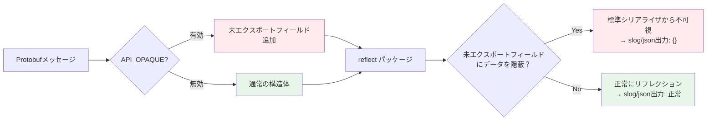

## 3行まとめ

1. protoc-gen-go v1.36.0+のAPI_OPAQUEモードでは、slogでProtobufメッセージをロギングすると{}と出力される
2. API_OPAQUEモードは、未エクスポートフィールドにデータを隠蔽し、標準のリフレクションベースのシリアライザから不可視にする
3. protojson.Marshal + json.RawMessageを使うことで、API_OPAQUEの影響を受けずに正しくJSONロギングできる

## 1. はじめに

gRPCでインターセプタを使ってリクエスト/レスポンスをロギングする際、Protobufメッセージを `slog.Any()` で出力しようとすると、期待に反して空のJSON `{}` が出力される現象に遭遇することがあります。

```json
{"level":"INFO","msg":"Request","request":{}}  // <- メッセージ内容が空！
```

この問題は、protoc-gen-goの新しいバージョン（特にv1.36.0以降でデフォルト化が進む）で導入された API_OPAQUE モード（Opaque API） が原因です。この記事では、この問題の技術的な背景と、protojsonを使った解決方法を詳しく解説します。

<https://go.dev/blog/protobuf-opaque>

### 前提知識

この記事は、以下の知識を前提としています：

* connect-goの基本的な使い方
* log/slog の基本的な使い方
* Protobufの基本概念

### 前提環境

* Go 1.21以降（log/slog の使用のため）
* protoc-gen-go v1.36.0以降（またはAPI_OPAQUEモードを有効にしたv1.32.0以降）
* google.golang.org/protobuf v1.36.0以降

## 2. 問題の再現：Protobufメッセージが{}と表示される

まず、問題を実際に再現してみましょう。

### 2-1. Protobuf定義

シンプルなユーザー情報のメッセージを定義します。

```protobuf
// user.proto
syntax = "proto3";

package example.v1;

message User {
  string user_id = 1;
  string name = 2;
}
```

上記の.protoファイルを以下の `buf.gen.yaml` 設定で生成します。このとき、API_OPAQUEモードを有効にします。

```yaml
version: v2

managed:
  enabled: true
  override:
    - file_option: go_package_prefix
      value: github.com/haru-256/blog-protobuf-api-opaque-message-logging/gen/go

plugins:
  - remote: buf.build/protocolbuffers/go:v1.36.10
    out: gen/go
    opt:
      - paths=source_relative
      - default_api_level=API_OPAQUE # API_OPAQUEモードを有効化
  - remote: buf.build/grpc/go:v1.5.1
    out: gen/go
    opt:
      - paths=source_relative
  - remote: buf.build/connectrpc/go:v1.18.1
    out: gen/go
    opt:
      - paths=source_relative

```

### 2-2. 問題のあるロギングコード

このメッセージをslogで直接ロギングしようとします。

```go
package main

import (
    "log/slog"
    "os"

    examplev1 "example/v1"
)

func main() {
    // JSONハンドラでロガーを作成
    logger := slog.New(slog.NewJSONHandler(os.Stdout, &slog.HandlerOptions{
        Level: slog.LevelDebug,
    }))

    // Protobufメッセージを作成
    user := &examplev1.User{}
    user.SetUserId("user-123") // API_OPAQUEモードではセッターを使う必要がある
    user.SetName("Alice")

    // slog.Any()で直接ロギング
    logger.Info("User Info", slog.Any("user", user))
}
```

### 2-3. 実際の出力結果

**期待する出力：**

```json
{"time":"2024-01-15T10:30:00Z","level":"INFO","msg":"User Info","user":{"user_id":"user-123","name":"Alice"}}
```

**実際の出力（API_OPAQUEモードの場合）：**

```json
{"time":"2024-01-15T10:30:00Z","level":"INFO","msg":"User Info","user":{}}
```

メッセージの内容が完全に失われ、空のオブジェクト `{}` として出力されてしまいます。

## 3. 原因：API_OPAQUEモードとは

### 3-1. API_OPAQUEモードの導入背景

GoのProtobuf実装では、将来的な互換性と安全性を高めるために Opaque API (API_OPAQUE) への移行が進められています。protoc-gen-go v1.36.0 (Edition 2024) からは、これがデフォルトの動作となるケースが増えています。

<https://go.dev/blog/protobuf-opaque>

このモードにより、以下の恩恵が得られます。

* **カプセル化の強化**: Protobufメッセージの内部実装の詳細を隠蔽する
* **後方互換性の向上**: 将来的な内部実装の変更を容易にする
* **型安全性の向上**: 直接フィールドアクセスではなく、公式APIを通じたアクセスを推奨する

利用者視点では、3つ目の「型安全性の向上」が特に重要です。内部実装の隠蔽化により、直接フィールドを書き換えることができなくなるため、不正な状態（例: Oneofの矛盾など）を作り出すリスクが減ります。また、ポインタの比較ミス（実体ではなくアドレスを比較してしまうバグ）なども防ぐことができます。

### 3-2. API_OPAQUEモードの仕組み



API_OPAQUEモードが有効な場合、生成される構造体には `xxx_` プレフィックスの未エクスポートフィールド（プライベートフィールド）が追加され、実際のデータはそこに格納されるか、あるいはアクセサ経由でしか触れない内部状態として管理されます。

```go
// API_OPAQUEモードで生成された構造体（簡略版）
type User struct {
    state             protoimpl.MessageState `protogen:"opaque.v1"`
    unknownFields     protoimpl.UnknownFields
    sizeCache         protoimpl.SizeCache

    xxx_hidden_UserId string                 `protobuf:"bytes,1,opt,name=user_id,json=userId,proto3"`
    xxx_hidden_Name   string                 `protobuf:"bytes,2,opt,name=name,proto3"`
}
```

### 3-3. Goのreflectパッケージの動作

Goの `encoding/json` や `reflect` パッケージは、構造体のエクスポートされたフィールド（大文字始まり）のみを対象にシリアライズを行います。

API_OPAQUEモードでは、データの実体が未エクスポートフィールドに隠蔽されているため、標準の `json.Marshal` やそれを内部で使う `slog` のハンドラからは、「空の構造体」あるいは「出力すべきフィールドがない構造体」に見えてしまいます。

これが、ログ出力が `{}` になってしまう技術的な原因です。これは意図的な設計であり、Protobufの内部表現への依存を防ぐための措置ですが、汎用的なロガーにとっては不都合な副作用となります。

## 4. 解決方法：protojsonの使用

### 4-1. protojsonとは

`google.golang.org/protobuf/encoding/protojson` パッケージは、Protobufメッセージ専用のJSONエンコーダー/デコーダーです。

以下の特徴があり、今回の問題解決に最適です。

* リフレクションではなく、**Protobufのスキーマ情報**に基づいて変換を行う
* API_OPAQUEモードの影響を受けない
* Protobuf仕様に準拠したJSON出力（フィールド名のcamelCase変換など）

### 4-2. 実装：FormatLogValue関数

以下のヘルパー関数を定義します。

```go
package logging

import (
    "encoding/json"
    "log/slog"

    "google.golang.org/protobuf/encoding/protojson"
    "google.golang.org/protobuf/proto"
)

// FormatLogValue は Protobuf メッセージを slog で正しく表示可能な形式に変換します。
func FormatLogValue(msg any) any {
    // nil 安全性チェック
    if msg == nil {
        return nil
    }

    // 1. msg が proto.Message インターフェースを実装しているかチェック
    pMsg, ok := msg.(proto.Message)
    if !ok {
        // Protobuf メッセージでなければ、slog のデフォルト処理に任せる
        return msg
    }

    // 2. protojson を使ってJSONバイト列にマーシャル
    // リフレクションではなく、Protobufのスキーマ情報に基づいて変換される
    b, err := protojson.MarshalOptions{
        UseProtoNames:   false, // false = camelCase（デフォルト）, true = snake_case
        EmitUnpopulated: false, // false = ゼロ値を省略（デフォルト）, true = ゼロ値も出力
    }.Marshal(pMsg)
    if err != nil {
        // マーシャル失敗時はエラーメッセージを返す
        return fmt.Sprintf("protojson marshal error: %v", err)
    }

    // 3. 最重要ポイント：json.RawMessage として返す
    // これにより、slog の JSONHandler は「これは既にJSONである」と認識し,
    // エスケープせずにそのまま埋め込む
    //
    // 誤った方法: string(b)を返す
    // → "user": "{\"userId\":\"user-123\",\"name\":\"Alice\"}" （JSONがエスケープされた文字列）
    //
    // 正しい方法: json.RawMessage(b)を返す
    // → "user": {"userId":"user-123","name":"Alice"} （ネストされたJSONオブジェクト）
    return json.RawMessage(b)
}
```

### 4-3. 実装のポイント解説

#### ポイント1: proto.Messageインターフェースのチェック

```go
pMsg, ok := msg.(proto.Message)
if !ok {
    return msg
}
```

Protobufメッセージかどうかを型アサーションで確認します。Protobufメッセージでない場合は、通常のslogの処理に任せます。これにより、汎用的なロギングヘルパーとして使えます。

#### ポイント2: json.RawMessageの使用

```go
return json.RawMessage(b)
```

これが最も重要なポイントです。

**json.RawMessage とは：**

`encoding/json` パッケージの型で、「すでにJSONとしてエンコードされたバイト列」を表します。

```go
type RawMessage []byte
```

slogのJSONHandlerは、`json.RawMessage` 型を検出すると、「これは既にJSON形式なので、そのまま埋め込む」という処理を行います。

**比較：**

| 方法 | コード | 出力結果 |
|------|--------|----------|
| ❌ 文字列として返す | `slog.StringValue(string(b))` | `"user": "{\"user_id\":\"123\"}"` |
| ✅ RawMessageとして返す | `json.RawMessage(b)` | `"user": {"user_id":"123"}` |

## 5. 使用例：インターセプタでの活用

### 5-1. 修正後のロギングコード

最初の問題のあるコードを修正します。

```go
package main

import (
    "log/slog"
    "os"

    examplev1 "example/v1"
    "yourproject/logging" // FormatLogValue を含むパッケージ
)

func main() {
    logger := slog.New(slog.NewJSONHandler(os.Stdout, &slog.HandlerOptions{
        Level: slog.LevelDebug,
    }))

    user := &examplev1.User{}
    user.SetUserId("user-123") // API_OPAQUEモードではセッターを使う必要がある
    user.SetName("Alice")

    // FormatLogValue を使ってロギング
    logger.Info("User Info", slog.Any("user", logging.FormatLogValue(user)))
}
```

### 5-2. 修正後の出力結果

```json
{"time":"2024-01-15T10:30:00Z","level":"INFO","msg":"User Info","user":{"user_id":"user-123","name":"Alice"}}
```

期待通りにすべてのフィールドが正しく出力されます。

## 6. まとめ

この記事では、protoc-gen-go v1.36.0+のAPI_OPAQUEモードによって発生する、Protobufメッセージのslogロギング問題とその解決方法を解説しました。

**重要なポイント：**

1. **API_OPAQUEモード**は、messageのフィールドが未エクスポートフィールドになるため、slogやencoding/jsonで正しくシリアライズできない。
2. **protojson.Marshal**を使うことで、スキーマベースの変換が可能になり、正しくJSON化できる。
3. **json.RawMessage**でラップすることで、slogが正しくJSONとして認識する

この解決方法を使うことで、connect-goのインターセプタで安全かつ効率的にProtobufメッセージをロギングできます。

### 参考リンク

* [google.golang.org/protobuf/encoding/protojson パッケージ](https://pkg.go.dev/google.golang.org/protobuf/encoding/protojson)
* [protoc-gen-go リリースノート v1.36.0](https://github.com/protocolbuffers/protobuf-go/releases/tag/v1.36.0) - API_OPAQUEモードの詳細
* [Go Protobuf APIドキュメント](https://protobuf.dev/reference/go/go-generated/)
* [log/slog パッケージ](https://pkg.go.dev/log/slog)
* [connect-goインターセプタ実装パターンガイド - Unary/Streaming対応](https://zenn.dev/haru256/articles/d6742c40e1e185) - インターセプタの実装方法
