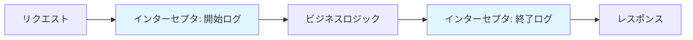
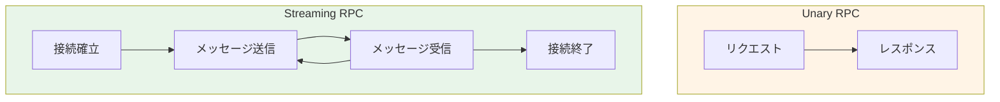
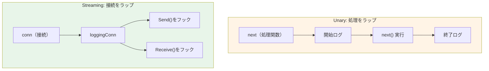
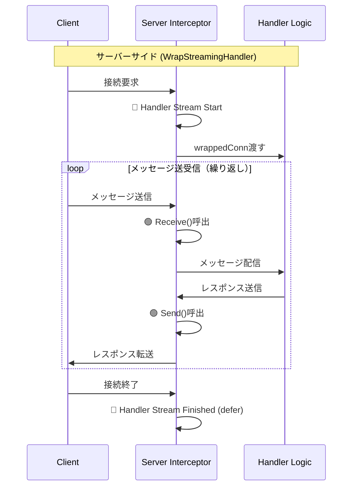
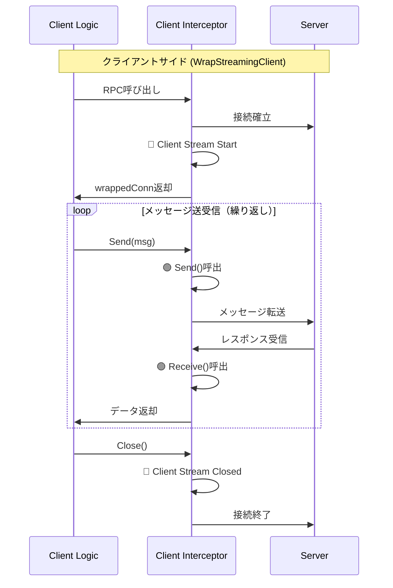

## 3行まとめ

1. connect-goのインターセプタは、Unary/Streaming両方のRPCに対して共通のロギング・認証・メトリクス処理を適用できる強力な仕組み
2. Unaryは`next`処理をラップ、Streamingはサーバー側でhandlerに渡す`conn`、クライアント側で`next`から取得する`conn`をラップして実装
3. Streamingでは接続開始(🔵)・メッセージ送受信(🟢)・接続終了(🔴)の3つのタイミングでロギングが必要

## 1. はじめに

connect-goは、gRPC (HTTP/2) と独自のConnectプロトコル (HTTP/1.1, HTTP/2) の両方をサポートする、非常に強力なRPCフレームワークです。Webブラウザとバックエンドサービス間でシームレスな型安全通信を実現し、開発体験を大幅に向上させます。

多くのWebフレームワークが「ミドルウェア」という概念を持つのと同様に、connect-goは「インターセプタ (Interceptor)」という仕組みを提供します。これは、実際のリクエスト処理の前後に共通の処理（認証、バリデーション、ロギング、メトリクス収集など）を挟み込むためのAOP（アスペクト指向プログラミング）的な機能です。

なかでも **リクエストロギング** は、システムの観測可能性 (Observability) において最も重要な基盤の一つです。開発中のデバッグはもちろん、本番環境で「何が起こったのか」を追跡するために不可欠です。

### この記事で得られること

この記事では、connect-goのインターセプタ機能を使い、Go 1.21+ 標準の構造化ロギングライブラリ log/slog をベースにした、実践的なリクエストロギングインターセプタの実装方法を徹底的に解説します。

具体的には、以下のすべてをカバーするReqRespLoggerインターセプタを実装します。

1. **Unary RPC**（1対1リクエスト）の開始ログと終了ログ
2. **Streaming RPC**（双方向ストリーミング）の接続開始、送受信、終了のライフサイクル全体のロギング
3. slog を使った構造化されたログ出力

### 対象読者

* connect-goで共通のロギング処理を実装したい人
* slog を使ってProtobufメッセージを正しく構造化ログとして出力したい人
* UnaryとStreaming、両方のインターセプタの実装方法の違いを理解したい人

### 前提環境

* Go 1.21以降（log/slog の使用のため）
* connect-go v1.x
* connect-goの基本的な使用経験

## 2. インターセプタによるロギングの必要性

なぜインターセプタが必要なのでしょうか？ 各RPCハンドラ（メソッド）の先頭と末尾にロギング処理を直接記述することも可能です。

// 良くない例：ハンドラにロギングが散在する

```go
func (s *MyServer) GetUser(ctx context.Context, req *connect.Request[pb.GetUserRequest]) (*connect.Response[pb.GetUserResponse], error) {
    s.logger.InfoContext(ctx, "Request Start", "method", "GetUser", "user_id", req.Msg.UserId) // <-- 処理①

    // ... ビジネスロジック ...

    if err != nil {
        s.logger.ErrorContext(ctx, "Request Error", "method", "GetUser", "error", err) // <-- 処理②
        return nil, err
    }

    s.logger.InfoContext(ctx, "Request Success", "method", "GetUser") // <-- 処理③
    return res, nil
}
```

このアプローチには多くの問題があります。

* **重複 (Don't Repeat Yourself違反)**: すべてのハンドラに同様のコードを書く必要があり、冗長です。
* **漏れ**: 新しいハンドラを追加した際に、ロギング処理を忘れる可能性があります。
* **ビジネスロジックの汚染**: ハンドラの本来の責務である「ビジネスロジック」と、「ロギング」という横断的な関心事が混在し、可読性とメンテナンス性が低下します。

インターセプタは、これらの「横断的な関心事 (Cross-Cutting Concerns)」をビジネスロジックから完全に分離し、アプリケーションの入り口で一元的に処理することを可能にします。



この記事で作成する ReqRespLogger は、connect.Interceptor インターフェースを実装した構造体として設計します。

## 3. 基本的な実装：ReqRespLoggerの準備

まず、インターセプタの全体像を定義します。connect-goのインターセプタは、3つのメソッドを持つ connect.Interceptor インターフェースを実装する必要があります。

```go
// connect.Interceptor インターフェース定義
type Interceptor interface {
    WrapUnary(connect.UnaryFunc) connect.UnaryFunc
    WrapStreamingClient(connect.StreamingClientFunc) connect.StreamingClientFunc
    WrapStreamingHandler(connect.StreamingHandlerFunc) connect.StreamingHandlerFunc
}
```

* WrapUnary: Unary RPC（クライアント/サーバー両方）に介入します。
* WrapStreamingClient: クライアント側のStreaming RPCに介入します。
* WrapStreamingHandler: サーバー（ハンドラ）側のStreaming RPCに介入します。



これらを実装する ReqRespLogger 構造体と、そのコンストラクタを定義します。この記事を通して、これら3つのメソッドを順番に実装していきます。

```go
package interceptor

import (
    "context"
    "errors"
    "io"
    "log/slog"
    "time"

    "connectrpc.com/connect"
)

// ReqRespLogger は connect.Interceptor を実装するロギングインターセプタです。
type ReqRespLogger struct {
    logger *slog.Logger
}

// NewReqRespLogger は ReqRespLogger の新しいインスタンスを生成します。
func NewReqRespLogger(logger *slog.Logger) *ReqRespLogger {
    return &ReqRespLogger{
        logger: logger,
    }
}

// この後、以下の3つのメソッドを実装していきます：
// - WrapUnary: Unary RPCのロギング（セクション5）
// - WrapStreamingHandler: サーバー側Streaming RPCのロギング（セクション6.1）
// - WrapStreamingClient: クライアント側Streaming RPCのロギング（セクション6.2）
```

### Unary RPC専用の簡単な実装方法

この記事では ReqRespLogger という構造体で connect.Interceptor インターフェース（3つのメソッドすべて）を実装します。これは、UnaryとStreamingの両方に対応する包括的なロガーを作るためです。

もし、**Streaming RPCをサポートする必要がなく、Unary RPCだけに**インターセプタを適用したい場合は、もっと簡単な方法が用意されています。

connect-go は connect.UnaryInterceptorFunc というヘルパー型（関数型）を提供しています。

```go
// connect.UnaryInterceptorFunc の定義
type UnaryInterceptorFunc func(connect.UnaryFunc) connect.UnaryFunc
```

これは、WrapUnary メソッドとまったく同じシグネチャを持つ関数です。この関数型を直接使うことで、connect.Interceptor インターフェースを実装したことになり、WrapStreamingClient や WrapStreamingHandler のためだけに空のメソッドを実装する必要がなくなります。

実装例:

```go
// Unary専用ロギングインターセプタを「関数」として定義
func NewSimpleUnaryLogger(logger *slog.Logger) connect.UnaryInterceptorFunc {
    // connect.UnaryInterceptorFunc 型の関数を返す
    return func(next connect.UnaryFunc) connect.UnaryFunc {
        // WrapUnary の中身だけを実装
        return func(ctx context.Context, req connect.AnyRequest) (connect.AnyResponse, error) {
            start := time.Now()
            logger.InfoContext(ctx, "Unary Start", slog.String("procedure", req.Spec().Procedure))

            res, err := next(ctx, req)

            duration := time.Since(start)
            if err != nil {
                logger.ErrorContext(ctx, "Unary Error", slog.String("error", err.Error()), slog.Duration("duration", duration))
            } else {
                logger.InfoContext(ctx, "Unary Success", slog.Duration("duration", duration))
            }
            return res, err
        }
    }
}

// --- サーバーやクライアントへの適用 ---
// logger := slog.Default()
// simpleLogger := NewSimpleUnaryLogger(logger)
//
// client := pb.NewFooServiceClient(
//     http.DefaultClient,
//     "http://localhost:8080",
//     connect.WithInterceptors(simpleLogger), // <-- そのまま渡せる
// )
```

このように、Unary RPCのみを扱う場合は connect.UnaryInterceptorFunc を使うと非常に簡潔に記述できます。

この記事では、UnaryとStreamingの両方に対応するため、connect.Interceptor を構造体で実装する方法で解説を続けます。

## 4. インターセプタの適用方法

インターセプタを定義したら、サーバー（ハンドラ）またはクライアントに適用する必要があります。これは、それぞれのコンストラクタオプションで connect.WithInterceptors を渡すことで実現します。

### サーバー（ハンドラ）への適用

サーバー側では、connect.New\<Service\>Handler のオプションとしてインターセプタを渡します。

```go
package main

import (
    "log/slog"
    "net/http"
    "os"

    "connectrpc.com/connect"
    "github.com/myproject/mypb/v1/mypbv1connect" // サービス固有の生成コードパス
    "github.com/myproject/interceptor"          // 今回作成したインターセプタのパス
)

func main() {
    // 1. ロガーの準備 (例: JSONハンドラ、DEBUGレベル)
    logger := slog.New(slog.NewJSONHandler(os.Stdout, &slog.HandlerOptions{Level: slog.LevelDebug}))

    // 2. インターセプタのインスタンス化
    // (この記事で実装する ReqRespLogger インターセプタ)
    loggingInterceptor := interceptor.NewReqRespLogger(logger)

    // (バリデーションインターセプタなど、他も追加可能)
    // validationInterceptor := interceptor.NewValidationInterceptor()

    // 3. インターセプタオプションの作成
    interceptorOption := connect.WithInterceptors(
        loggingInterceptor,
        // validationInterceptor, // 複数のインターセプタを渡すことも可能
    )

    // 4. ハンドラの初期化時にオプションとして渡す
    path, handler := mypbv1connect.NewMyServiceHandler(
        &myServiceImpl{}, // サービスの実装
        interceptorOption, // <-- ここで適用
    )

    // 5. サーバーの起動
    mux := http.NewServeMux()
    mux.Handle(path, handler)
    http.ListenAndServe(":8080", mux)
}

// myServiceImpl はサービス定義の例
type myServiceImpl struct {
    mypbv1connect.UnimplementedMyServiceHandler // 未実装メソッドのフォールバック
}
// (ここにサービスの実装を記述)
```

### クライアントへの適用

クライアント側でも同様に、connect.New\<Service\>Client のオプションとしてインターセプタを渡します。

```go
package main

import (
    "log/slog"
    "net/http"
    "os"

    "connectrpc.com/connect"
    "github.com/myproject/mypb/v1/mypbv1connect" // サービス固有の生成コードパス
    "github.com/myproject/interceptor"          // 今回作成したインターセプタのパス
)

func main() {
    // (ロガーとインターセプタの準備)
    logger := slog.New(slog.NewJSONHandler(os.Stdout, &slog.HandlerOptions{Level: slog.LevelDebug}))
    loggingInterceptor := interceptor.NewReqRespLogger(logger)

    // 1. クライアントの初期化時にオプションとして渡す
    client := mypbv1connect.NewMyServiceClient(
        http.DefaultClient,
        "http://localhost:8080", // 接続先サーバー
        connect.WithInterceptors(loggingInterceptor), // <-- ここで適用
        connect.WithGRPC(), // gRPCプロトコルを使用する場合
    )

    // ... (clientを使ったRPC呼び出し)
    // 例:
    // res, err := client.SayHello(context.Background(), connect.NewRequest(&mypb.SayHelloRequest{...}))
}
```

このように、connect.WithInterceptors を使うことで、実装したインターセプタを（複数であっても）簡単に有効化できます。

## 5. Unary RPCのロギング（WrapUnary）

Unary RPCは、リクエストとレスポンスが1回ずつ行われる、最もシンプルな通信です。

WrapUnary は connect.UnaryFunc 型の関数 next を引数に取り、同じ connect.UnaryFunc 型の関数を返す必要があります。これは典型的なデコレータパターンであり、next（本体処理）を実行する前後に処理を挟み込みます。

```go
// WrapUnary は Unary RPC の処理をラップします。
func (i *ReqRespLogger) WrapUnary(next connect.UnaryFunc) connect.UnaryFunc {
    // next（本体処理）をラップした新しい関数を返す
    return func(ctx context.Context, req connect.AnyRequest) (connect.AnyResponse, error) {
        // リクエストのタイムスタンプ
        start := time.Now()

        // リクエスト開始ログ
        i.logUnaryStart(ctx, req)

        // 実行結果（レスポンスとエラー）
        var code connect.Code

        // 本体処理(next)の実行
        res, err := next(ctx, req)

        if err != nil {
            // エラーが存在する場合、connect.Codeを取得
            code = connect.CodeOf(err)
        } else {
            // 成功
            code = connect.CodeOK
        }

        // リクエスト終了ログ
        i.logUnaryEnd(ctx, req, res, err, code, time.Since(start))

        return res, err
    }
}

// logUnaryStart はUnaryリクエストの開始をロギングします。
func (i *ReqRespLogger) logUnaryStart(ctx context.Context, req connect.AnyRequest) {
    // (connect.StreamTypeUnary はサーバー/クライアント共通の定数)
    // (i.logger.Log は logger.go の実装に合わせたヘルパー)
    i.logger.InfoContext(ctx, "Unary Request Start",
        slog.String("procedure", req.Spec().Procedure),
        slog.String("user_agent", req.Header().Get("User-Agent")),
        slog.String("peer_addr", req.Peer().Addr),
        // DEBUGレベルでリクエストペイロードをロギング
        slog.Any("request", req.Any()),
    )
}

// logUnaryEnd はUnaryリクエストの終了をロギングします。
func (i *ReqRespLogger) logUnaryEnd(
    ctx context.Context,
    req connect.AnyRequest,
    res connect.AnyResponse,
    err error,
    code connect.Code,
    duration time.Duration,
) {
    // エラーレベルを選択
    logLevel := slog.LevelInfo
    if err != nil {
        logLevel = slog.LevelError
    }

    i.logger.Log(ctx, logLevel, "Unary Request End",
        slog.String("procedure", req.Spec().Procedure),
        slog.Duration("duration", duration),
        slog.String("code", code.String()),
        slog.String("error", safeErrorString(err)),
        // DEBUGレベルでレスポンスペイロードをロギング
        slog.Any("response", res.Any()),
    )
}
```

**注意**: `safeErrorString` はエラーがnilの場合に空文字列を返すヘルパー関数です。

```go
func safeErrorString(err error) string {
    if err != nil {
        return err.Error()
    }
    return ""
}
```

WrapUnary の実装はシンプルです。next の前後で開始ログと終了ログを呼び出しています。ログには procedure（RPCメソッド名）や処理時間（duration）、エラー情報（code, error）を含めることで、どの処理にどれだけ時間がかかり、どういう結果になったのかが一目でわかります。

## 6. Streaming RPCのロギング（WrapStreamingHandler / WrapStreamingClient）

Streaming RPCは、接続が継続し、その上でメッセージが複数回（0回以上）送受信されるため、Unary RPCとはロギングの仕方が根本的に異なります。

**Unaryが「処理（next）」をラップするのに対し、Streamingは「接続（Conn）」をラップします。**



Streaming RPCのロギングは、サーバーサイド（ハンドラ）とクライアントサイドで実装方法が異なります。以下、それぞれの視点から詳しく解説します。

### 6-1. サーバーサイド（WrapStreamingHandler）の実装

サーバー側（ハンドラ側）では、connect.StreamingHandlerConn（接続オブジェクト）がインターセプタに渡されます。私たちはこの conn を、ロギング機能を持つカスタムconnでラップし、next（ハンドラのビジネスロジック）に渡します。

#### サーバーサイドのロギングタイミング（ハンドラの視点）



**ロギングタイミング：**

* 🔵 **Handler Stream Start**: クライアントからの接続確立時（1回のみ）
* 🟢 **Handler Stream Send/Receive**: ハンドラがメッセージを送受信するたび（0回以上）
* 🔴 **Handler Stream Finished**: 接続終了時、deferにより必ず実行（1回のみ）

**実際のログ出力例（サーバーサイド）：**

```json
{"level":"INFO","msg":"Handler Stream Start","procedure":"/myservice/Chat"}      // 🔵
{"level":"DEBUG","msg":"Handler Stream Receive","message":{"text":"hello"}}    // 🟢
{"level":"DEBUG","msg":"Handler Stream Send","message":{"reply":"hi"}}         // 🟢
{"level":"DEBUG","msg":"Handler Stream Receive","message":{"text":"how are"}}  // 🟢
{"level":"DEBUG","msg":"Handler Stream Send","message":{"reply":"fine"}}       // 🟢
{"level":"DEBUG","msg":"Handler Stream Receive","message":{"text":"bye"}}      // 🟢
{"level":"DEBUG","msg":"Handler Stream Send","message":{"reply":"goodbye"}}    // 🟢
{"level":"INFO","msg":"Handler Stream Finished","duration":"2.5s"}            // 🔴
```

```go
// WrapStreamingHandler はサーバーサイドのストリーミングをラップします。
func (i *ReqRespLogger) WrapStreamingHandler(next connect.StreamingHandlerFunc) connect.StreamingHandlerFunc {
    return func(ctx context.Context, conn connect.StreamingHandlerConn) error {
        start := time.Now()

        // 🔵 タイミング1: 接続確立時（1回のみ）
        // クライアントからの接続が確立された直後に実行されます
        i.logger.InfoContext(ctx, "Handler Stream Start",
            slog.String("procedure", conn.Spec().Procedure),
            slog.String("peer_addr", conn.Peer().Addr),
        )

        // 🔴 タイミング3: 接続終了時（1回のみ）
        // defer により、next()が完了（正常終了/エラー問わず）した後に実行されます
        defer func() {
            duration := time.Since(start)
            i.logger.InfoContext(ctx, "Handler Stream Finished",
             slog.Duration("duration", duration),
             slog.String("procedure", conn.Spec().Procedure),
            )
        }()

        // loggingHandlerConn で conn をラップ
        // これにより、Send/Receiveが呼ばれるたびにログが出力されます
        wrappedConn := &loggingHandlerConn{
            StreamingHandlerConn: conn,
            logger:               i.logger,
        }

        // ラップした接続(wrappedConn)を使って本体処理(next)を実行
        // next()内でSend/Receiveが呼ばれると、🟢のログが出力されます
        return next(ctx, wrappedConn)
    }
}

// loggingHandlerConn はサーバーサイドの送受信をフックします。
type loggingHandlerConn struct {
    connect.StreamingHandlerConn // 元のconnを埋め込む
    logger *slog.Logger
}

// Receive メソッドをオーバーライド
// 🟢 タイミング2: ハンドラがクライアントからメッセージを受信するたびに実行
func (c *loggingHandlerConn) Receive(msg any) error {
    err := c.StreamingHandlerConn.Receive(msg)

    // Streamの終端(io.EOF)はエラーではないため、区別する
    if err != nil && !errors.Is(err, io.EOF) {
        // c.Context() は埋め込まれた StreamingHandlerConn から継承されたメソッドで、
        // 現在のリクエストのコンテキストを返します
        c.logger.WarnContext(c.Context(), "Handler Stream Receive Error",
            slog.String("error", err.Error()),
        )
    } else if err == nil {
        // 受信成功: DEBUGレベルでメッセージ内容を記録
        c.logger.DebugContext(c.Context(), "Handler Stream Receive",
            slog.Any("message", msg),
        )
    }
    // io.EOFの場合はログ出力なし（正常なストリーム終了のシグナル）
    return err
}

// Send メソッドをオーバーライド
// 🟢 タイミング2: ハンドラがクライアントへメッセージを送信するたびに実行
func (c *loggingHandlerConn) Send(msg any) error {
    err := c.StreamingHandlerConn.Send(msg)

    if err != nil {
        c.logger.WarnContext(c.Context(), "Handler Stream Send Error",
            slog.String("error", err.Error()),
        )
    } else {
        // 送信成功: DEBUGレベルでメッセージ内容を記録
        c.logger.DebugContext(c.Context(), "Handler Stream Send",
            slog.Any("message", msg),
        )
    }
    return err
}
```

ポイントは loggingHandlerConn 構造体です。connect.StreamingHandlerConn を埋め込み、Receive と Send メソッドだけをオーバーライド（上書き）しています。これにより、next 処理が wrappedConn.Receive() を呼ぶと、我々のロギング処理を経由してから、本来の StreamingHandlerConn.Receive() が呼ばれるようになります。

### 6-2. クライアントサイド（WrapStreamingClient）の実装

クライアント側も同様に「接続（Conn）」をラップしますが、next の役割がハンドラ側とは異なります。

クライアント側の next は「connect.StreamingClientConn（接続オブジェクト）を**生成する関数**」です。そのため、next を実行して Conn を取得し、それをラップして**返却します**。

#### クライアントサイドのロギングタイミング（呼び出し側の視点）



**ロギングタイミング：**

* 🔵 **Client Stream Start**: サーバーへの接続確立時（1回のみ）
* 🟢 **Client Stream Send/Receive**: クライアントがメッセージを送受信するたび（0回以上）
* 🔴 **Client Stream Closed**: クライアントがClose()を呼び出した時（1回のみ）

**実際のログ出力例（クライアントサイド）：**

```json
{"level":"INFO","msg":"Client Stream Start","procedure":"/myservice/Chat"}        // 🔵
{"level":"DEBUG","msg":"Client Stream Send","message":{"text":"hello"}}        // 🟢
{"level":"DEBUG","msg":"Client Stream Receive","message":{"reply":"hi"}}       // 🟢
{"level":"DEBUG","msg":"Client Stream Send","message":{"text":"how are"}}     // 🟢
{"level":"DEBUG","msg":"Client Stream Receive","message":{"reply":"fine"}}    // 🟢
{"level":"DEBUG","msg":"Client Stream Send","message":{"text":"bye"}}         // 🟢
{"level":"DEBUG","msg":"Client Stream Receive","message":{"reply":"goodbye"}} // 🟢
{"level":"INFO","msg":"Client Stream Closed","procedure":"/myservice/Chat"}     // 🔴
```

```go
// WrapStreamingClient はクライアントサイドのストリーミングをラップします。
func (i *ReqRespLogger) WrapStreamingClient(next connect.StreamingClientFunc) connect.StreamingClientFunc {
    return func(ctx context.Context, spec connect.Spec) connect.StreamingClientConn {

        // 1. next() を呼び、実際の接続(conn)を取得
        conn := next(ctx, spec)

        // 🔵 タイミング1: 接続確立時（1回のみ）
        // サーバーへの接続が確立された直後に実行されます
        i.logger.InfoContext(ctx, "Client Stream Start",
            slog.String("procedure", spec.Procedure),
        )

        // 2. 取得した conn をラップして返す
        // これにより、Send/Receive/Closeが呼ばれるたびにログが出力されます
        return &loggingClientConn{
            StreamingClientConn: conn, // 元のconnを埋め込む
            logger:              i.logger,
            spec:                spec,
        }
    }
}

// loggingClientConn はクライアントサイドの送受信とクローズをフックします。
type loggingClientConn struct {
    connect.StreamingClientConn // 元のconnを埋め込む
    logger *slog.Logger
    spec   connect.Spec
}

// Send メソッドをオーバーライド
// 🟢 タイミング2: クライアントがサーバーへメッセージを送信するたびに実行
func (c *loggingClientConn) Send(msg any) error {
    err := c.StreamingClientConn.Send(msg)
    if err != nil {
        c.logger.WarnContext(c.Context(), "Client Stream Send Error",
            slog.String("procedure", c.spec.Procedure),
            slog.String("error", err.Error()),
        )
    } else {
        // 送信成功: DEBUGレベルでメッセージ内容を記録
        c.logger.DebugContext(c.Context(), "Client Stream Send",
            slog.String("procedure", c.spec.Procedure),
            slog.Any("message", msg),
        )
    }
    return err
}

// Receive メソッドをオーバーライド
// 🟢 タイミング2: クライアントがサーバーからメッセージを受信するたびに実行
func (c *loggingClientConn) Receive(msg any) error {
    err := c.StreamingClientConn.Receive(msg)
    if err != nil && !errors.Is(err, io.EOF) {
        c.logger.WarnContext(c.Context(), "Client Stream Receive Error",
            slog.String("procedure", c.spec.Procedure),
            slog.String("error", err.Error()),
        )
    } else if err == nil {
        // 受信成功: DEBUGレベルでメッセージ内容を記録
        c.logger.DebugContext(c.Context(), "Client Stream Receive",
            slog.String("procedure", c.spec.Procedure),
            slog.Any("message", msg),
        )
    }
    // io.EOFの場合はログ出力なし（正常なストリーム終了のシグナル）
    return err
}

// Close メソッドをオーバーライド (クライアント側特有)
// 🔴 タイミング3: クライアントが接続を明示的にクローズする時に実行（1回のみ）
func (c *loggingClientConn) Close() error {
    err := c.StreamingClientConn.Close()

    // クライアントが明示的に Close したタイミングをロギング
    c.logger.InfoContext(c.Context(), "Client Stream Closed",
        slog.String("procedure", c.spec.Procedure),
        slog.String("error", safeErrorString(err)),
    )
    return err
}
```

**注意**: `safeErrorString` は上記のUnaryセクションで定義したヘルパー関数と同じものです。

## 7. 注意点とベストプラクティス

インターセプタは強力ですが、本番環境での運用にはいくつかの注意点があります。

* **ログレベルの使い分け**
  ペイロード（リクエスト/レスポンス本体）のロギングは非常に詳細であり、ログの量を肥大化させます。上記の実装例のように、リクエストの開始/終了（Handler Stream Start / Finished）は INFO レベルで常に出力し、ペイロード（Send / Receive）は DEBUG レベルで出力するのが良いでしょう。これにより、本番環境ではログレベルを INFO に設定し、問題発生時のみ DEBUG に切り替えて詳細を調査できます。

```go
// 本番環境: INFOレベル
logger := slog.New(slog.NewJSONHandler(os.Stdout, &slog.HandlerOptions{
    Level: slog.LevelInfo, // Send/Receiveの詳細ログは出力されない
}))

// デバッグ時: DEBUGレベル
logger := slog.New(slog.NewJSONHandler(os.Stdout, &slog.HandlerOptions{
    Level: slog.LevelDebug, // すべてのログが出力される
}))
```

* **PII（個人識別情報）のマスキング**
  ペイロードには、パスワード、メールアドレス、氏名などの機密情報（PII）が含まれる可能性があります。これらをそのままログに出力することは、セキュリティリスクや法令違反（GDPRなど）につながる可能性があります。
  対策として、connect-go-redact のようなペイロードをマスキングするインターセプタをロギングインターセプタと併用するか、ロギングインターセプタ自体にマスキングロジックを組み込むことを検討してください。

* **パフォーマンスへの影響**
  毎秒数万リクエストを処理するような高スループット環境で、すべてのリクエストのペイロードを DEBUG レベルでロギングすると、CPUリソースを消費します。本番環境での DEBUG レベルのロギングは、必要な期間のみ有効にすることを推奨します。

## 8. まとめ

connect-goのインターセプタは、ロギング、認証、メトリクスといった横断的な関心事を分離するための強力な仕組みです。

この記事では、slog をベースに、Unary RPCとStreaming RPCの両方のライフサイクルをカバーする実践的なロギングインターセプタ ReqRespLogger を実装しました。

* **適用方法**: connect.WithInterceptors を使い、ハンドラやクライアントのオプションとして渡します。
* **Unary** では、next（処理）をラップします。
* **Streaming** では、conn（接続）をラップし、Send/Receiveメソッドをオーバーライドします。

このインターセプタを導入することで、アプリケーションの観測可能性は劇的に向上し、開発や運用がよりスムーズになると幸いです。

### 参考リンク

* [connect-go 公式ドキュメント: Interceptors](https://connectrpc.com/docs/go/interceptors)
* [Go 1.21 log/slog パッケージ](https://pkg.go.dev/log/slog)
* [connect-go-redact: ペイロードマスキングライブラリ](https://github.com/pentops/connect-go-redact)
* [log/slog のベストプラクティス](https://betterstack.com/community/guides/logging/logging-in-go/)
