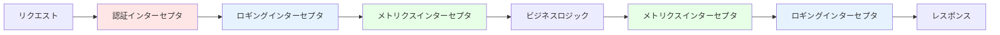
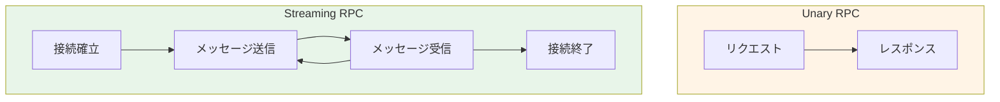
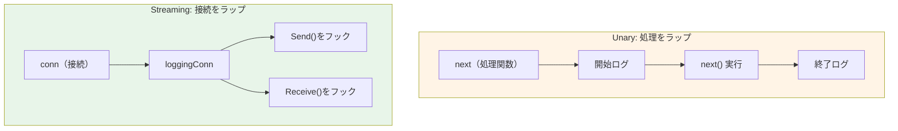
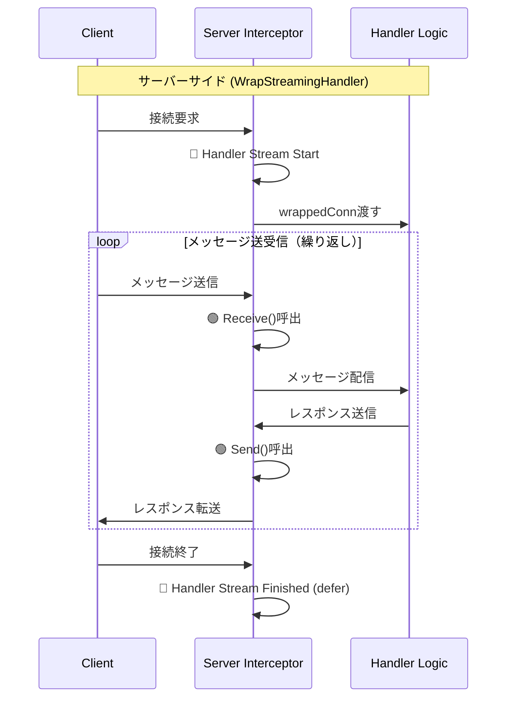
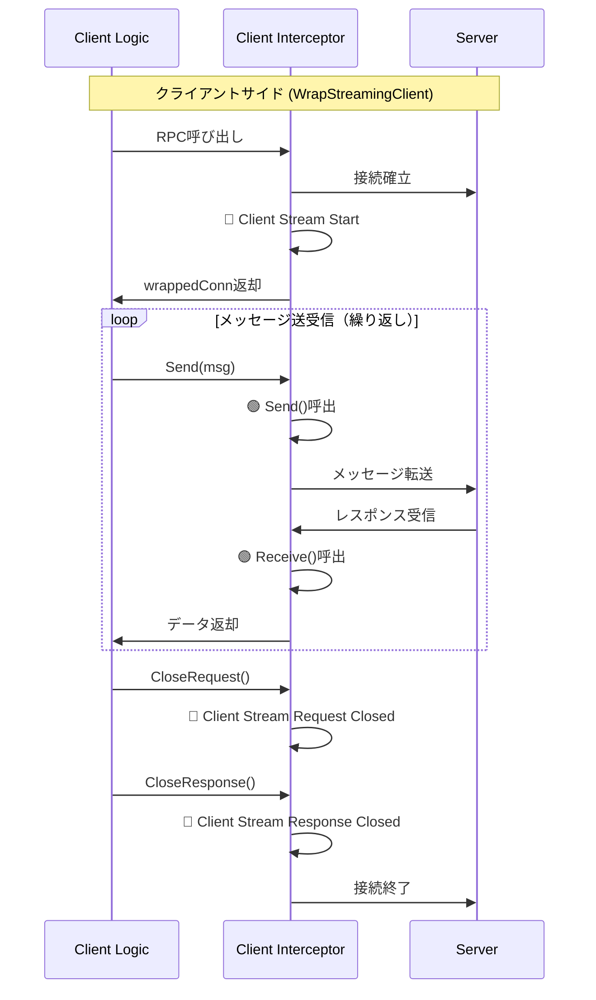

## 3行まとめ

1. connect-goのインターセプタは`connect.Interceptor`インターフェースの3メソッド(WrapUnary/WrapStreamingClient/WrapStreamingHandler)を実装することで、認証・ロギング・メトリクスなど横断的関心事を一元管理できる
2. **Unary RPCは`next`(処理関数)をラップ**するのに対し、**Streaming RPCは`conn`(接続オブジェクト)をラップ**してSend/Receiveメソッドをフックする点が根本的に異なる
3. クライアント側とサーバー側でStreamingの実装パターンが異なる:サーバーは`conn`を受け取ってラップ、クライアントは`next`から`conn`を生成してラップして返却

## 1. はじめに

connect-goは、gRPC (HTTP/2) と独自のConnectプロトコル (HTTP/1.1, HTTP/2) の両方をサポートする、非常に強力なRPCフレームワークです。Webブラウザとバックエンドサービス間でシームレスな型安全通信を実現し、開発体験を大幅に向上させます。

多くのWebフレームワークが「ミドルウェア」という概念を持つのと同様に、connect-goは「インターセプタ (Interceptor)」という仕組みを提供します。これは、実際のリクエスト処理の前後に共通の処理を挟み込むためのAOP(アスペクト指向プログラミング)的な機能です。

しかし、Unary RPCとStreaming RPCでは、インターセプタの実装パターンが根本的に異なります。よくインターネットにある情報はUnary RPCに偏っており、Streaming RPCの扱い方については十分に解説されておらず、私自身も最初は混乱しました。

### この記事で得られること

この記事では、connect-goのインターセプタの**実装パターンとライフサイクル**を、実践的なコード例を通じて徹底的に解説します。

具体的には、以下を学べます:

1. connect.Interceptorインターフェースの3メソッドの役割と実装方法
2. Unary RPCとStreaming RPCの実装パターンの違い(処理ラップ vs 接続ラップ)
3. サーバー側とクライアント側のStreaming実装の違い
4. 実装例として、ロギング・認証・メトリクスなど様々な用途への応用方法

### この記事が解決する課題

connect-goの公式ドキュメントはインターセプタの基本は説明していますが、Unary/Streamingの実装パターンの違いやクライアント/サーバーでのStreamingの扱い方の違いについて、体系的にまとめられた日本語の情報が少ないのが現状です。

この記事では、ロギングインターセプタを実装しつつ、ライフサイクル全体(開始・処理・終了)を可視化して、インターセプタの動作を理解します。

### 対象読者

* connect-goでインターセプタを実装したいが、どう書けばいいか分からない人
* UnaryとStreaming、両方のインターセプタの実装方法の違いを理解したい人
* 認証、メトリクス、ロギングなど横断的関心事を一元管理したい人

### 前提環境

* Go 1.21以降（log/slog の使用のため）
* connect-go v1.x
* connect-goの基本的な使用経験

### サンプルコード

この記事で解説する実装は、以下のリポジトリで完全なサンプルコードとして公開しています。実際に動かしてログ出力を確認できます：

[haru-256/blog-connect-go-interceptor](https://github.com/haru-256/blog-connect-go-interceptor)

記事を読みながらコードを確認したい方や、実際のログの流れを見たい方は、ぜひリポジトリもご活用ください。

## 2. インターセプタで実装できる横断的関心事

インターセプタがなくとも、各RPCハンドラ(メソッド)に直接処理を記述することも可能です。

```go
// 良くない例:ハンドラに横断的関心事が散在する
func (s *MyServer) GetUser(ctx context.Context, req *connect.Request[pb.GetUserRequest]) (*connect.Response[pb.GetUserResponse], error) {
    // 認証チェック
    if !s.auth.Verify(ctx) {
        return nil, connect.NewError(connect.CodeUnauthenticated, errors.New("unauthorized"))
    }
    
    // ロギング
    s.logger.InfoContext(ctx, "Request Start", "method", "GetUser")
    start := time.Now()
    
    // バリデーション
    if req.Msg.UserId == "" {
        return nil, connect.NewError(connect.CodeInvalidArgument, errors.New("user_id required"))
    }

    // ... 本来のビジネスロジック ...

    // メトリクス記録
    s.metrics.RecordDuration("GetUser", time.Since(start))
    s.logger.InfoContext(ctx, "Request Success")
    return res, nil
}
```

しかし、このアプローチには多くの問題があります:

* **重複 (DRY違反)**: すべてのハンドラに同じコードを書く必要がある
* **漏れのリスク**: 新しいハンドラで認証チェックを忘れるなど、致命的なバグの原因に
* **責務の混在**: ビジネスロジックと横断的関心事が混在し、可読性が低下
* **変更の影響範囲**: ロギングフォーマットを変えたい場合、全ハンドラを修正する必要がある

インターセプタは、これらの横断的な関心事をビジネスロジックから完全に分離します。

### インターセプタで実装できる機能例



1. **認証・認可**: JWTトークン検証、権限チェック
2. **ロギング**: リクエスト/レスポンスの記録、エラートラッキング
3. **メトリクス**: レイテンシ測定、リクエスト数カウント、エラー率計測
4. **バリデーション**: 共通的な入力検証ルール
5. **レート制限**: API呼び出し頻度の制御
6. **トレーシング**: 分散トレーシング(OpenTelemetry連携)
7. **エラーハンドリング**: エラーコードの統一、リトライ処理

### この記事での実装例:ロギングインターセプタ

この記事では、ロギングを題材としてインターセプタの実装パターンを解説します。
ライフサイクル全体が可視化しやすいためロギングを選びました。

ただし、この実装パターンは認証やメトリクスにもそのまま応用できます。記事の後半で、他の用途への応用例も紹介します。

```go
// この記事で実装するインターセプタの構造
type ReqRespLogger struct {
    logger *slog.Logger
}

// connect.Interceptor インターフェースを実装
func (i *ReqRespLogger) WrapUnary(next connect.UnaryFunc) connect.UnaryFunc { /* ... */ }
func (i *ReqRespLogger) WrapStreamingClient(next connect.StreamingClientFunc) connect.StreamingClientFunc { /* ... */ }
func (i *ReqRespLogger) WrapStreamingHandler(next connect.StreamingHandlerFunc) connect.StreamingHandlerFunc { /* ... */ }
```

## 3. 基本的な実装：ReqRespLoggerの準備

まず、インターセプタの全体像を解説します。connect-goのインターセプタは、3つのメソッドを持つ connect.Interceptor インターフェースを実装する必要があります。

```go
// connect.Interceptor インターフェース定義
type Interceptor interface {
    WrapUnary(connect.UnaryFunc) connect.UnaryFunc
    WrapStreamingClient(connect.StreamingClientFunc) connect.StreamingClientFunc
    WrapStreamingHandler(connect.StreamingHandlerFunc) connect.StreamingHandlerFunc
}
```

* WrapUnary: Unary RPC（クライアント/サーバー両方）に介入します。
* WrapStreamingClient: クライアント側のStreaming RPCに介入します。
* WrapStreamingHandler: サーバー（ハンドラ）側のStreaming RPCに介入します。



これらを実装する ReqRespLogger 構造体と、そのコンストラクタを定義します。この記事を通して、これら3つのメソッドを順番に実装していきます。

```go
package interceptor

import (
    "context"
    "errors"
    "io"
    "log/slog"
    "time"

    "connectrpc.com/connect"
)

// ReqRespLogger は connect.Interceptor を実装するロギングインターセプタです。
type ReqRespLogger struct {
    logger *slog.Logger
}

// NewReqRespLogger は ReqRespLogger の新しいインスタンスを生成します。
func NewReqRespLogger(logger *slog.Logger) *ReqRespLogger {
    return &ReqRespLogger{
        logger: logger,
    }
}

// この後、以下の3つのメソッドを実装していきます：
// - WrapUnary: Unary RPCのロギング（セクション5）
// - WrapStreamingHandler: サーバー側Streaming RPCのロギング（セクション6.1）
// - WrapStreamingClient: クライアント側Streaming RPCのロギング（セクション6.2）
```

### Unary RPC専用の簡単な実装方法

この記事では ReqRespLogger という構造体で connect.Interceptor インターフェース（3つのメソッドすべて）を実装します。これは、UnaryとStreamingの両方に対応する包括的なロガーを作るためです。

もし、**Streaming RPCをサポートする必要がなく、Unary RPCだけに**インターセプタを適用したい場合は、もっと簡単な方法が用意されています。

connect-go は connect.UnaryInterceptorFunc というヘルパー型（関数型）を提供しています。

```go
// connect.UnaryInterceptorFunc の定義
type UnaryInterceptorFunc func(connect.UnaryFunc) connect.UnaryFunc
```

これは、WrapUnary メソッドとまったく同じシグネチャを持つ関数です。この関数型を直接使うことで、connect.Interceptor インターフェースを実装したことになり、WrapStreamingClient や WrapStreamingHandler のためだけに空のメソッドを実装する必要がなくなります。

実装例:

```go
// Unary専用ロギングインターセプタを「関数」として定義
func NewSimpleUnaryLogger(logger *slog.Logger) connect.UnaryInterceptorFunc {
    // connect.UnaryInterceptorFunc 型の関数を返す
    return func(next connect.UnaryFunc) connect.UnaryFunc {
        // WrapUnary の中身だけを実装
        return func(ctx context.Context, req connect.AnyRequest) (connect.AnyResponse, error) {
            start := time.Now()
            logger.InfoContext(ctx, "Unary Start", slog.String("procedure", req.Spec().Procedure))

            res, err := next(ctx, req)

            duration := time.Since(start)
            if err != nil {
                logger.ErrorContext(ctx, "Unary Error", slog.String("error", err.Error()), slog.Duration("duration", duration))
            } else {
                logger.InfoContext(ctx, "Unary Success", slog.Duration("duration", duration))
            }
            return res, err
        }
    }
}

// --- サーバーやクライアントへの適用 ---
// logger := slog.Default()
// simpleLogger := NewSimpleUnaryLogger(logger)
//
// client := pb.NewFooServiceClient(
//     http.DefaultClient,
//     "http://localhost:8080",
//     connect.WithInterceptors(simpleLogger), // <-- そのまま渡せる
// )
```

このように、Unary RPCのみを扱う場合は connect.UnaryInterceptorFunc を使うと非常に簡潔に記述できます。
この記事では、UnaryとStreamingの両方に対応するため、connect.Interceptor を構造体で実装する方法で解説を続けます。

## 4. インターセプタの適用方法

インターセプタを定義したら、サーバー（ハンドラ）またはクライアントに適用する必要があります。これは、それぞれのコンストラクタオプションで connect.WithInterceptors を渡すことで実現します。

### サーバー（ハンドラ）への適用

サーバー側では、connect.New\<Service\>Handler のオプションとしてインターセプタを渡します。

```go
package main

import (
    "log/slog"
    "net/http"
    "os"

    "connectrpc.com/connect"
    "github.com/myproject/mypb/v1/mypbv1connect" // サービス固有の生成コードパス
    "github.com/myproject/interceptor"          // 今回作成したインターセプタのパス
)

func main() {
    // 1. ロガーの準備 (例: JSONハンドラ、DEBUGレベル)
    logger := slog.New(slog.NewJSONHandler(os.Stdout, &slog.HandlerOptions{Level: slog.LevelDebug}))

    // 2. インターセプタのインスタンス化
    // (この記事で実装する ReqRespLogger インターセプタ)
    loggingInterceptor := interceptor.NewReqRespLogger(logger)

    // (バリデーションインターセプタなど、他も追加可能)
    // validationInterceptor := interceptor.NewValidationInterceptor()

    // 3. インターセプタオプションの作成
    interceptorOption := connect.WithInterceptors(
        loggingInterceptor,
        // validationInterceptor, // 複数のインターセプタを渡すことも可能
    )

    // 4. ハンドラの初期化時にオプションとして渡す
    path, handler := mypbv1connect.NewMyServiceHandler(
        &myServiceImpl{}, // サービスの実装
        interceptorOption, // <-- ここで適用
    )

    // 5. サーバーの起動
    mux := http.NewServeMux()
    mux.Handle(path, handler)
    http.ListenAndServe(":8080", mux)
}

// myServiceImpl はサービス定義の例
type myServiceImpl struct {
    mypbv1connect.UnimplementedMyServiceHandler // 未実装メソッドのフォールバック
}
// (ここにサービスの実装を記述)
```

### クライアントへの適用

クライアント側でも同様に、connect.New\<Service\>Client のオプションとしてインターセプタを渡します。

```go
package main

import (
    "log/slog"
    "net/http"
    "os"

    "connectrpc.com/connect"
    "github.com/myproject/mypb/v1/mypbv1connect" // サービス固有の生成コードパス
    "github.com/myproject/interceptor"          // 今回作成したインターセプタのパス
)

func main() {
    // (ロガーとインターセプタの準備)
    logger := slog.New(slog.NewJSONHandler(os.Stdout, &slog.HandlerOptions{Level: slog.LevelDebug}))
    loggingInterceptor := interceptor.NewReqRespLogger(logger)

    // HTTP/2クライアントの設定（gRPCプロトコル使用時に必要）
    httpClient := &http.Client{
        Transport: &http2.Transport{
            AllowHTTP: true, // h2c (HTTP/2 Cleartext) を許可
            DialTLSContext: func(ctx context.Context, network, addr string, cfg *tls.Config) (net.Conn, error) {
                // TLSなしで接続
                return net.Dial(network, addr)
            },
        },
    }

    // 1. クライアントの初期化時にオプションとして渡す
    client := mypbv1connect.NewMyServiceClient(
        httpClient, // HTTP/2対応のクライアントを使用
        "http://localhost:8080", // 接続先サーバー
        connect.WithInterceptors(loggingInterceptor), // <-- ここで適用
        connect.WithGRPC(), // gRPCプロトコルを使用する場合
    )

    // ... (clientを使ったRPC呼び出し)
    // 例:
    // res, err := client.SayHello(context.Background(), connect.NewRequest(&mypb.SayHelloRequest{...}))
}
```

このように、connect.WithInterceptors を使うことで、実装したインターセプタを（複数であっても）簡単に有効化できます。

## 5. Unary RPCのロギング（WrapUnary）

Unary RPCは、リクエストとレスポンスが1回ずつ行われる、最もシンプルな通信です。

WrapUnary は connect.UnaryFunc 型の関数 next を引数に取り、同じ connect.UnaryFunc 型の関数を返す必要があります。これは典型的なデコレータパターンであり、next（本体処理）を実行する前後に処理を挟み込みます。

```go
// WrapUnary は Unary RPC の処理をラップします。
func (i *ReqRespLogger) WrapUnary(next connect.UnaryFunc) connect.UnaryFunc {
    // next（本体処理）をラップした新しい関数を返す
    return func(ctx context.Context, req connect.AnyRequest) (connect.AnyResponse, error) {
        // リクエストのタイムスタンプ
        start := time.Now()

        // リクエスト開始ログ
        i.logUnaryStart(ctx, req)

        // 実行結果（レスポンスとエラー）
        var code connect.Code

        // 本体処理(next)の実行
        res, err := next(ctx, req)

        if err != nil {
            // エラーが存在する場合、connect.Codeを取得
            code = connect.CodeOf(err)
        } else {
            // 成功
            code = connect.CodeOK
        }

        // リクエスト終了ログ
        i.logUnaryEnd(ctx, req, res, err, code, time.Since(start))

        return res, err
    }
}

// logUnaryStart はUnaryリクエストの開始をロギングします。
func (i *ReqRespLogger) logUnaryStart(ctx context.Context, req connect.AnyRequest) {
    // DEBUGレベルでリクエストペイロードをロギング
    i.logger.DebugContext(ctx, "🔵 Unary Request Start",
        slog.String("procedure", req.Spec().Procedure),
        slog.Any("request_body", req.Any()),
    )
}

// logUnaryEnd はUnaryリクエストの終了をロギングします。
func (i *ReqRespLogger) logUnaryEnd(
    ctx context.Context,
    req connect.AnyRequest,
    res connect.AnyResponse,
    err error,
    code connect.Code,
    duration time.Duration,
) {
    if err != nil {
        // エラーの場合はERRORレベルでログ出力
        i.logger.ErrorContext(ctx, "🔴 Unary Request Finished (error)",
            slog.String("procedure", req.Spec().Procedure),
            slog.Duration("duration", duration),
            slog.String("error", err.Error()),
        )
    } else {
        // 成功時はINFOレベルで出力
        i.logger.InfoContext(ctx, "🔴 Unary Request Finished",
            slog.String("procedure", req.Spec().Procedure),
            slog.Duration("duration", duration),
        )

        // DEBUGレベルでレスポンスペイロードをロギング
        i.logger.DebugContext(ctx, "🔴 Unary Request Finished",
            slog.String("procedure", req.Spec().Procedure),
            slog.Duration("duration", duration),
            slog.Any("response_body", res.Any()),
        )
    }
}
```

WrapUnary の実装はシンプルです。next の前後で開始ログと終了ログを呼び出しています。ログには procedure（RPCメソッド名）や処理時間（duration）、エラー情報を含めることで、どの処理にどれだけ時間がかかり、どういう結果になったのかが一目でわかります。

**絵文字マーカー**: ログメッセージには視覚的な識別のために絵文字を使用しています（🔵: 開始、🟢: 送受信、🔴: 終了）。これらはログ分析時に便利ですが、本番環境では削除することも可能です。

## 6. Streaming RPCのロギング（WrapStreamingHandler / WrapStreamingClient）

Streaming RPCは、接続が継続し、その上でメッセージが複数回（0回以上）送受信されるため、Unary RPCとはロギングの仕方が根本的に異なります。

**Unaryが「処理（next）」をラップするのに対し、Streamingは「接続（Conn）」をラップします。**



Streaming RPCのロギングは、サーバーサイド（ハンドラ）とクライアントサイドで実装方法が異なります。以下、それぞれの視点から詳しく解説します。

### 6-1. Streamingの3つのタイプ

Streaming RPCには3つのタイプがあります：

1. **双方向ストリーミング (Bidirectional Streaming)**
   * クライアントとサーバーの両方が複数のメッセージを送受信
   * `Send()`と`Receive()`を両方とも複数回呼び出し可能
   * 例：チャットアプリケーション

2. **クライアントストリーミング (Client Streaming)**
   * クライアントが複数のメッセージを送信し、サーバーが1つのレスポンスを返す
   * クライアント側：`Send()`を複数回 + `CloseAndReceive()`で最終レスポンスを受信
   * サーバー側：`Receive()`を複数回 + 最後に1回`Send()`
   * 例：ファイルアップロード

3. **サーバーストリーミング (Server Streaming)**
   * クライアントが1つのリクエストを送信し、サーバーが複数のレスポンスを返す
   * クライアント側：1回`Send()` + `CloseRequest()` + `Receive()`を複数回
   * サーバー側：1回`Receive()` + `Send()`を複数回
   * 例：大量データの取得、リアルタイム通知

**重要**: この記事で実装するインターセプタは、すべてのストリーミングタイプに対して共通で動作します。`Send()`/`Receive()`/`CloseRequest()`/`CloseResponse()`/`CloseAndReceive()`のいずれが呼ばれても適切にロギングされます。

### 6-2. サーバーサイド（WrapStreamingHandler）の実装

サーバー側（ハンドラ側）では、connect.StreamingHandlerConn（接続オブジェクト）がインターセプタに渡されます。私たちはこの conn を、ロギング機能を持つカスタムconnでラップし、next（ハンドラのビジネスロジック）に渡します。

#### サーバーサイドのロギングタイミング（ハンドラの視点）



**ロギングタイミング：**

* 🔵 **Handler Stream Start**: クライアントからの接続確立時（1回のみ）
* 🟢 **Handler Stream Send/Receive**: ハンドラがメッセージを送受信するたび（0回以上）
* 🔴 **Handler Stream Finished**: 接続終了時、deferにより必ず実行（1回のみ）

**実際のログ出力例（サーバーサイド）：**

```json
{"level":"INFO","msg":"Handler Stream Start","procedure":"/myservice/Chat"}      // 🔵
{"level":"DEBUG","msg":"Handler Stream Receive","message":{"text":"hello"}}    // 🟢
{"level":"DEBUG","msg":"Handler Stream Send","message":{"reply":"hi"}}         // 🟢
{"level":"DEBUG","msg":"Handler Stream Receive","message":{"text":"how are"}}  // 🟢
{"level":"DEBUG","msg":"Handler Stream Send","message":{"reply":"fine"}}       // 🟢
{"level":"DEBUG","msg":"Handler Stream Receive","message":{"text":"bye"}}      // 🟢
{"level":"DEBUG","msg":"Handler Stream Send","message":{"reply":"goodbye"}}    // 🟢
{"level":"INFO","msg":"Handler Stream Finished","duration":"2.5s"}            // 🔴
```

```go
// WrapStreamingHandler はサーバーサイドのストリーミングをラップします。
func (i *ReqRespLogger) WrapStreamingHandler(next connect.StreamingHandlerFunc) connect.StreamingHandlerFunc {
    return func(ctx context.Context, conn connect.StreamingHandlerConn) error {
        start := time.Now()

        // 🔵 タイミング1: 接続確立時（1回のみ）
        // クライアントからの接続が確立された直後に実行されます
        i.logger.InfoContext(ctx, "🔵 Handler Stream Start",
            slog.String("procedure", conn.Spec().Procedure),
        )

        // 🔴 タイミング3: 接続終了時（1回のみ）
        // defer により、next()が完了（正常終了/エラー問わず）した後に実行されます
        defer func() {
            duration := time.Since(start)
            i.logger.InfoContext(ctx, "🔴 Handler Stream Finished",
                slog.String("procedure", conn.Spec().Procedure),
                slog.Duration("duration", duration),
            )
        }()

        // loggingHandlerConn で conn をラップ
        // これにより、Send/Receiveが呼ばれるたびにログが出力されます
        wrappedConn := &loggingHandlerConn{
            StreamingHandlerConn: conn,
            logger:               i.logger,
            ctx:                  ctx,
        }

        // ラップした接続(wrappedConn)を使って本体処理(next)を実行
        // next()内でSend/Receiveが呼ばれると、🟢のログが出力されます
        return next(ctx, wrappedConn)
    }
}

// loggingHandlerConn はサーバーサイドの送受信をフックします。
type loggingHandlerConn struct {
    connect.StreamingHandlerConn // 元のconnを埋め込む
    logger *slog.Logger
    ctx    context.Context // コンテキストをフィールドとして保持
}

// Receive メソッドをオーバーライド
// 🟢 タイミング2: ハンドラがクライアントからメッセージを受信するたびに実行
func (c *loggingHandlerConn) Receive(msg any) error {
    err := c.StreamingHandlerConn.Receive(msg)

    // Streamの終端(io.EOF)はエラーではないため、区別する
    if err != nil && !errors.Is(err, io.EOF) {
        c.logger.ErrorContext(c.ctx, "🟢 Handler Stream Receive (error)",
            slog.String("procedure", c.Spec().Procedure),
            slog.String("error", err.Error()),
        )
    } else if err == nil {
        // 受信成功: DEBUGレベルでメッセージ内容を記録
        c.logger.DebugContext(c.ctx, "🟢 Handler Stream Receive",
            slog.String("procedure", c.Spec().Procedure),
            slog.Any("message", msg),
        )
    }
    // io.EOFの場合はログ出力なし（正常なストリーム終了のシグナル）
    return err
}

// Send メソッドをオーバーライド
// 🟢 タイミング2: ハンドラがクライアントへメッセージを送信するたびに実行
func (c *loggingHandlerConn) Send(msg any) error {
    err := c.StreamingHandlerConn.Send(msg)

    if err != nil {
        c.logger.ErrorContext(c.ctx, "🟢 Handler Stream Send (error)",
            slog.String("procedure", c.Spec().Procedure),
            slog.String("error", err.Error()),
        )
    } else {
        // 送信成功: DEBUGレベルでメッセージ内容を記録
        c.logger.DebugContext(c.ctx, "🟢 Handler Stream Send",
            slog.String("procedure", c.Spec().Procedure),
            slog.Any("message", msg),
        )
    }
    return err
}
```

ポイントは loggingHandlerConn 構造体です。connect.StreamingHandlerConn を埋め込み、Receive と Send メソッドだけをオーバーライド（上書き）しています。これにより、next 処理が wrappedConn.Receive() を呼ぶと、我々のロギング処理を経由してから、本来の StreamingHandlerConn.Receive() が呼ばれるようになります。

### 6-3. クライアントサイド（WrapStreamingClient）の実装

クライアント側も同様に「接続（Conn）」をラップしますが、next の役割がハンドラ側とは異なります。

クライアント側の next は「connect.StreamingClientConn（接続オブジェクト）を**生成する関数**」です。そのため、next を実行して Conn を取得し、それをラップして**返却します**。

#### クライアントサイドのロギングタイミング（呼び出し側の視点）



**ロギングタイミング：**

* 🔵 **Client Stream Start**: サーバーへの接続確立時（1回のみ）
* 🟢 **Client Stream Send/Receive**: クライアントがメッセージを送受信するたび（0回以上）
* 🔴 **Client Stream Request/Response Closed**: クライアントがCloseRequest()/CloseResponse()を呼び出した時（各1回ずつ）

**実際のログ出力例（クライアントサイド）：**

```json
{"level":"INFO","msg":"Client Stream Start","procedure":"/myservice/Chat"}        // 🔵
{"level":"DEBUG","msg":"Client Stream Send","message":{"text":"hello"}}        // 🟢
{"level":"DEBUG","msg":"Client Stream Receive","message":{"reply":"hi"}}       // 🟢
{"level":"DEBUG","msg":"Client Stream Send","message":{"text":"how are"}}     // 🟢
{"level":"DEBUG","msg":"Client Stream Receive","message":{"reply":"fine"}}    // 🟢
{"level":"DEBUG","msg":"Client Stream Send","message":{"text":"bye"}}         // 🟢
{"level":"DEBUG","msg":"Client Stream Receive","message":{"reply":"goodbye"}} // 🟢
{"level":"INFO","msg":"Client Stream Request Closed","procedure":"/myservice/Chat"}  // 🔴
{"level":"INFO","msg":"Client Stream Response Closed","procedure":"/myservice/Chat"} // 🔴
```

```go
// WrapStreamingClient はクライアントサイドのストリーミングをラップします。
func (i *ReqRespLogger) WrapStreamingClient(next connect.StreamingClientFunc) connect.StreamingClientFunc {
    return func(ctx context.Context, spec connect.Spec) connect.StreamingClientConn {

        // 1. next() を呼び、実際の接続(conn)を取得
        conn := next(ctx, spec)

        // 🔵 タイミング1: 接続確立時（1回のみ）
        // サーバーへの接続が確立された直後に実行されます
        i.logger.InfoContext(ctx, "🔵 Client Stream Start",
            slog.String("procedure", spec.Procedure),
        )

        // 2. 取得した conn をラップして返す
        // これにより、Send/Receive/CloseRequest/CloseResponseが呼ばれるたびにログが出力されます
        return &loggingClientConn{
            StreamingClientConn: conn, // 元のconnを埋め込む
            logger:              i.logger,
            ctx:                 ctx,
            spec:                spec,
        }
    }
}

// loggingClientConn はクライアントサイドの送受信とクローズをフックします。
type loggingClientConn struct {
    connect.StreamingClientConn // 元のconnを埋め込む
    logger *slog.Logger
    ctx    context.Context // コンテキストをフィールドとして保持
    spec   connect.Spec
}

// Send メソッドをオーバーライド
// 🟢 タイミング2: クライアントがサーバーへメッセージを送信するたびに実行
func (c *loggingClientConn) Send(msg any) error {
    err := c.StreamingClientConn.Send(msg)
    if err != nil {
        c.logger.ErrorContext(c.ctx, "🟢 Client Stream Send (error)",
            slog.String("procedure", c.spec.Procedure),
            slog.String("error", err.Error()),
        )
    } else {
        // 送信成功: DEBUGレベルでメッセージ内容を記録
        c.logger.DebugContext(c.ctx, "🟢 Client Stream Send",
            slog.String("procedure", c.spec.Procedure),
            slog.Any("message", msg),
        )
    }
    return err
}

// Receive メソッドをオーバーライド
// 🟢 タイミング2: クライアントがサーバーからメッセージを受信するたびに実行
func (c *loggingClientConn) Receive(msg any) error {
    err := c.StreamingClientConn.Receive(msg)
    if err != nil && !errors.Is(err, io.EOF) {
        c.logger.ErrorContext(c.ctx, "🟢 Client Stream Receive (error)",
            slog.String("procedure", c.spec.Procedure),
            slog.String("error", err.Error()),
        )
    } else if err == nil {
        // 受信成功: DEBUGレベルでメッセージ内容を記録
        c.logger.DebugContext(c.ctx, "🟢 Client Stream Receive",
            slog.String("procedure", c.spec.Procedure),
            slog.Any("message", msg),
        )
    }
    // io.EOFの場合はログ出力なし（正常なストリーム終了のシグナル）
    return err
}

// CloseRequest メソッドをオーバーライド (クライアント側特有)
// 🔴 タイミング3a: クライアントが送信を終了する時に実行（1回のみ）
func (c *loggingClientConn) CloseRequest() error {
    err := c.StreamingClientConn.CloseRequest()

    if err != nil {
        c.logger.ErrorContext(c.ctx, "🔴 Client Stream Request Close (error)",
            slog.String("procedure", c.spec.Procedure),
            slog.String("error", err.Error()),
        )
    } else {
        // クライアントが送信を終了したタイミングをロギング
        c.logger.InfoContext(c.ctx, "🔴 Client Stream Request Close",
            slog.String("procedure", c.spec.Procedure),
        )
    }
    return err
}

// CloseResponse メソッドをオーバーライド (クライアント側特有)
// 🔴 タイミング3b: クライアントが受信を終了する時に実行（1回のみ）
func (c *loggingClientConn) CloseResponse() error {
    err := c.StreamingClientConn.CloseResponse()

    if err != nil {
        c.logger.ErrorContext(c.ctx, "🔴 Client Stream Response Close (error)",
            slog.String("procedure", c.spec.Procedure),
            slog.String("error", err.Error()),
        )
    } else {
        // クライアントが受信を終了したタイミングをロギング
        c.logger.InfoContext(c.ctx, "🔴 Client Stream Response Close",
            slog.String("procedure", c.spec.Procedure),
        )
    }
    return err
}
```

**CloseAndReceiveについて**: `CloseAndReceive()`メソッドはクライアントストリーミング専用の便利メソッドで、送信終了と最終レスポンス受信を1回の呼び出しで実行します。このメソッドは内部的に`CloseRequest()`と`Receive()`を呼び出すため、オーバーライドしなくても上記の`CloseRequest`と`Receive`メソッドのログが自動的に出力されます。そのため、`CloseAndReceive`メソッドを明示的にオーバーライドする必要はありません。

## 7. サンプルコードで実際のログ出力を確認

この記事で解説したインターセプタの実装と、実際に動作するサンプルコードを以下のリポジトリで公開しています：

**[haru-256/blog-connect-go-interceptor](https://github.com/haru-256/blog-connect-go-interceptor)**

このリポジトリには、以下のすべてが含まれています：

* **完全なインターセプタ実装** (`internal/interceptor/logger.go`)
* **サーバー実装** (Unary, Server/Client/Bidirectional Streaming)
* **クライアント実装** (各RPC種別の呼び出し例)

サーバーとクライアントを実際に動かすことで、この記事で説明したログがどのような順番で出力されるかを確認できます。

```bash
# サーバーの起動
make run-server

# 別のターミナルで各RPCを実行
make get-user        # Unary RPC
make list-users      # Server Streaming
make update-users    # Client Streaming
make chat            # Bidirectional Streaming
```

各コマンドを実行すると、サーバー側とクライアント側の両方で、🔵（開始）→ 🟢（送受信）→ 🔴（終了）の順番でログが出力される様子を確認できます。

特に、Bidirectional Streaming（chat）では、クライアントが複数のメッセージを送信（🟢 Send）した後に接続をクローズ（🔴 CloseRequest）し、その後サーバーからのレスポンスを受信（🟢 Receive）する様子が観察できます。これにより、ストリーミングの非同期性とインターセプタのロギングタイミングが理解しやすくなります。

実際のBidirectional Streaming（chat）の実行結果は以下のようになります：

Client側


Server側


## 8. まとめ

connect-goのインターセプタは、ロギング、認証、メトリクスといった横断的な関心事を分離するための便利な仕組みです。

この記事では、slog をベースに、Unary RPCとStreaming RPCの両方のライフサイクルをカバーする実践的なロギングインターセプタ ReqRespLogger を実装しました。

* **適用方法**: connect.WithInterceptors を使い、ハンドラやクライアントのオプションとして渡します。
* **Unary** では、next（処理）をラップします。
* **Streaming** では、conn（接続）をラップし、Send/Receiveメソッドをオーバーライドします。

この記事が、インターセプタの理解と実装に役立てば幸いです。ぜひサンプルコードを試しながら、実際のログ出力を確認してみてください。

### 参考リンク

* [connect-go 公式ドキュメント: Interceptors](https://connectrpc.com/docs/go/interceptors)
* [Go 1.21 log/slog パッケージ](https://pkg.go.dev/log/slog)
* [connect-go-redact: ペイロードマスキングライブラリ](https://github.com/pentops/connect-go-redact)
* [log/slog のベストプラクティス](https://betterstack.com/community/guides/logging/logging-in-go/)
