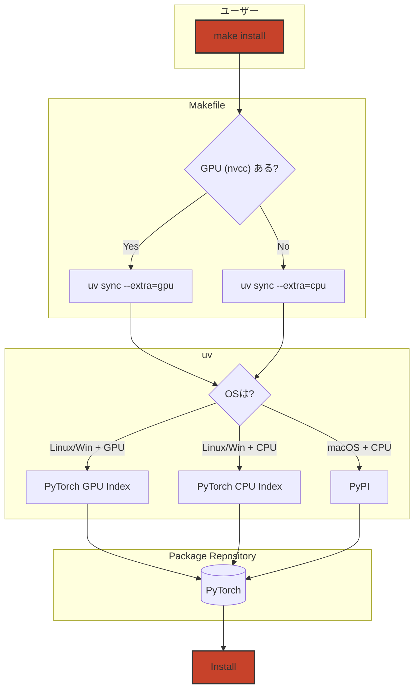

3行まとめ

- PyTorch環境構築で、OS（Mac/Linux）やGPU有無によって手順が異なり、チーム開発で統一が困難
- `uv`の`optional-dependencies`と`Makefile`を組み合わせ、環境差を自動判定してインストール先を切り替える仕組みを構築
- `make install` 一発で、macOS/Linux、そしてCPU/GPUどんな環境でも最適なPyTorch（CPU/GPU版）が自動インストールされ、環境構築が簡単にできる

## 1. はじめに：PyTorch環境構築のよくある悩み

機械学習プロジェクト、特にPyTorchを使った開発では、環境構築でつまずくことが少なくありません。

- 開発メンバーのOSがMac, Linuxとバラバラで、手順が統一できない
- 自分の手元のPCはCPU版、実験サーバーはGPU版など、環境によってインストールするPyTorchが違う
- 結果として、環境ごとの手順書が必要になり、セットアップに時間がかかったり、間違いが起きやすくなる

この記事では、最近のデファクトスタンダードとされているPythonパッケージ管理ツール`uv`を使って、これらの悩みを解決する方法を紹介します。

### この記事の対象読者

- PyTorchを使った機械学習プロジェクトを開発している方
- チームで環境構築を統一したい方
- `uv`の基本的な使い方を知っている方

※ `uv`自体の導入方法は[公式ドキュメント](https://docs.astral.sh/uv/getting-started/installation/)を参照してください。

### 前提条件

この記事の手順を実行するには、以下がインストールされている必要があります：

- `uv` (≥ 0.5.3)
- `make` コマンド（Linux/macOSは標準搭載）
- （GPU環境の場合）NVIDIA CUDA Toolkit 12.6

### この記事が目指すゴール

本記事のゴールは、**どんな環境でも `make install` という単一のコマンドを実行するだけで、最適なPyTorch（CPU版またはGPU版）が自動でインストールされる状態**を作ることです。

**所要時間**: 約15分（`uv`のインストールを除く）

例えば、チーム開発において、「AさんのmacOS/CPUマシン」と「BさんのLinux/GPUマシン」で、全く同じリポジトリとコマンドを使って、それぞれの環境に最適なPyTorch環境を構築できるようになります。

## 2. `uv`でPyTorchインストールを自動化する全体像

今回構築する仕組みの全体像は、以下のフロー図のようになります。



`uv`と`Makefile`を組み合わせることで、以下の処理を自動化します。

1. ユーザーが `make install` コマンドを実行します。
2. **Makefile**が、実行環境にNVIDIA GPU (CUDA) があるかを判定します。
3. 判定結果に応じて、`uv`に「CPU版 (`--extra=cpu`)」か「GPU版 (`--extra=gpu`)」かを指示します。
4. `uv`が、現在のOS（Mac/Linux）と指示された種別を元に、`pyproject.toml`に設定された最適なPyTorchのダウンロード先（Index）を自動で選択します。
5. 選択されたダウンロード先から、適切なPyTorchをインストールします。

この仕組みの核心となるのが、`pyproject.toml`での依存関係の定義です。次のセクションから、具体的な設定方法を解説します。

## 3. なぜ`uv`を使うのか？

`uv`は、`pip`や`poetry`, `pipenv`などと同じ、Pythonのパッケージ管理ツールです。Rust製であることによる処理速度が大きな特徴で、既存の`pip`や`pip-tools`のワークフローと互換性を持ちながら、開発体験を向上させることができます。

本記事で`uv`を使う理由は、`pipenv`など従来のツールでは複数ファイルに分ける必要があった複雑な依存関係を、`uv`なら単一のファイルで管理できるからです。

### `pipenv`でのパッケージ管理の課題

PyTorchのように、CPU版とGPU版でパッケージのダウンロード先（index URL）が異なる場合、`pipenv`では大きな課題がありました。`pipenv`は、OSごとにダウンロード先を切り替える設定を`Pipfile`に記述することができないため、Linux用とmacOS用で`Pipfile.lock`を別々に管理するなどの工夫が必要でした。これはリポジトリの複雑化を招き、管理コストの増大に繋がります。

### `uv`による解決策

一方、`uv`は`pyproject.toml`の中で、`marker`（環境変数などに応じた条件指定）を用いて、OSや環境ごとにダウンロード先を動的に切り替える設定を記述できます。

これにより、たった一つの`uv.lock`ファイルの中に、macOS/Linux、そしてCPU/GPUといった**全ての環境の依存関係情報を含めることが可能**になります。

この機能が、本記事で`uv`を採用した理由です。

## 4. クロスプラットフォームなPyTorchインストール手順

ここからは、具体的な設定方法を3つのステップで解説します。

### Step 1: `pyproject.toml` で依存関係を定義する

`pyproject.toml`に、`uv`に対して「どの環境でどのパッケージをどこからダウンロードするか」を指示する設定を記述します。これがクロスプラットフォームインストールを実現するための重要な設定です。

以下に全体の設定を示し、その後で各セクションを詳しく解説します。

```toml
[project]
name = "blog-install-pytorch-cpu-gpu"
version = "0.1.0"
description = "CPU/GPUのPyTorchをインストール方法を解説するブログのサンプルコード"
readme = "README.md"
requires-python = ">=3.12"
dependencies = [
    "numpy~=2.2.5",
    "loguru~=0.7.3"
]

# --- ここからが本記事主要部分 ---

[project.optional-dependencies]
cpu = ["torch==2.7.0"]
gpu = ["torch==2.7.0"]

[tool.uv]
# "cpu" と "gpu" の両方が同時に指定されるのを防ぐ
conflicts = [[{ extra = "cpu" }, { extra = "gpu" }]]

[tool.uv.sources]
torch = [
  # macOS (CPU版) はPyPIから取得
  { index = "pytorch-cpu-mac", extra = "cpu", marker = "platform_system == 'Darwin'" },
  # Linux (CPU版) はPyTorch専用indexから取得
  { index = "pytorch-cpu", extra = "cpu", marker = "platform_system != 'Darwin'" },
  # GPU版は全OS共通で専用indexから取得
  { index = "pytorch-gpu", extra = "gpu" },
]

[[tool.uv.index]]
name = "pytorch-cpu-mac"
url = "https://pypi.python.org/simple"
explicit = true # このindexは明示的に指定された場合のみ使われる

[[tool.uv.index]]
name = "pytorch-cpu"
url = "https://download.pytorch.org/whl/cpu"
explicit = true

[[tool.uv.index]]
name = "pytorch-gpu"
url = "https://download.pytorch.org/whl/cu126" # 別のCUDAバージョンを使う場合は適宜修正が必要
explicit = true
```

#### 解説：各セクションの役割

1. `[project.optional-dependencies]`
    ここでは、`cpu` と `gpu` という2つの追加の依存関係グループ（"extra"）を定義します。
    `torch`自体は必須のライブラリですが、あえて`optional-dependencies`に記述することで、インストール時に `cpu` か `gpu` かを選択できるようになります。

2. `[tool.uv.sources]`
    `torch`パッケージをどこからダウンロードするかを、条件に応じて指定します。
    - `extra = "cpu"` かつ `platform_system == 'Darwin'` の場合 (`marker`で指定) は、`pytorch-cpu-mac` という名前のindexを使う。
    - `extra = "cpu"` かつ macOS以外の場合 は、`pytorch-cpu` という名前のindexを使う。
    - `extra = "gpu"` の場合 は、`pytorch-gpu` という名前のindexを使う。
    このように、`extra`と`marker`を組み合わせることで、環境に応じたダウンロード先の切り替えを実現しています。

3. `[[tool.uv.index]]`
    `[tool.uv.sources]`で指定した各indexの具体的なURLを定義します。
    - `pytorch-cpu-mac`: 通常のPyPI (`https://pypi.python.org/simple`)
    - `pytorch-cpu`: PyTorchのCPU版専用リポジトリ
    - `pytorch-gpu`: PyTorchのGPU (CUDA 12.6) 版専用リポジトリ
    `explicit = true` は、`uv`が自動でこのindexを検索しに行くのではなく、`[tool.uv.sources]`で明示的に指定された場合にのみ使われるようにするための設定です。

#### なぜ`torch`を`optional-dependencies`に入れるのか？

`torch`は必須ライブラリですが、あえて`optional-dependencies`に記述する理由は、インストール時に「どのバージョンをどこから取得するか」を動的に選択するためです。通常の`dependencies`に入れると、この柔軟性が失われます。

この設定により、`uv`はインストールコマンドに`--extra=cpu`が指定されればCPU用の、`--extra=gpu`が指定されればGPU用のindexを、OS環境まで考慮して自動で選択するようになります。

### Step 2: `uv lock`ですべての環境のロックファイルを作成

`pyproject.toml`が準備できたら、ターミナルで以下のコマンドを実行します。

```bash
# このコマンドはプロジェクトのルートディレクトリで実行します
uv lock
```

このコマンドを実行すると、`uv`が`pyproject.toml`の設定を解析し、CPU/GPU、そしてmacOS/Linuxの**すべての組み合わせ**に対応する依存関係情報を`uv.lock`というファイルに書き出してくれます。

この`uv.lock`ファイルが、どんな環境でも同じインストール結果を保証するための「設計図」の役割を果たします。プロジェクトメンバーは、このファイルをGitリポジトリで共有することで、全員が同じバージョンのパッケージを利用できます。

### Step 3: `Makefile`でインストールを自動化する

最後に、ユーザーが実行するコマンドと、GPUの有無を判定するロジックを`Makefile`に記述します。これにより、ユーザーは環境を意識することなく、`make install`という統一されたコマンドを使えるようになります。

プロジェクトのルートディレクトリに、以下の内容で`Makefile`という名前のファイルを作成してください。

```makefile
# 注意: Makefileではインデントにタブ文字を使用してください
# `nvcc`コマンドが存在すれば1、しなければ0をHAS_CUDA変数に設定
HAS_CUDA := $(shell command -v nvcc 2>&1 /dev/null && echo 1 || echo 0)

.PHONY: install
install: ## プロジェクトのセットアップ
 @if [ $(HAS_CUDA) -eq 1 ]; then \
  echo "✅ GPU (CUDA) 環境を検出しました。GPU版PyTorchをインストールします。"; \
  uv sync --all-groups --extra=gpu; \
 else \
  echo "✅ CPU 環境を検出しました。CPU版PyTorchをインストールします。"; \
  uv sync --all-groups --extra=cpu; \
 fi
```

#### 解説：Makefileの役割

このMakefileは、`make install`というコマンドが実行されたときに、以下の処理を行います。

1. `HAS_CUDA := ...`
    - まず、`nvcc`というコマンドが実行可能か（`PATH`が通っているか）をチェックします。`nvcc`はNVIDIA CUDAコンパイラのコマンドで、これが存在すれば、その環境はGPU（CUDA）が利用可能な環境であると判断できます。結果は`HAS_CUDA`という変数に`1`（あり）または`0`（なし）として保存されます。

2. `install:`
    - `make install`の本体です。`if [ $(HAS_CUDA) -eq 1 ]`という条件分岐で、`HAS_CUDA`変数の値に応じて実行するコマンドを切り替えています。
        - **GPUがある場合**: `uv sync --all-groups --extra=gpu` を実行します。`--extra=gpu`が指定されたことで、`uv`は`pyproject.toml`の`[project.optional-dependencies]`で定義した`gpu`グループ（GPU版`torch`）をインストール対象に含めます。
        - **GPUがない場合**: `uv sync --all-groups --extra=cpu` を実行します。同様に`--extra=cpu`が指定され、CPU版`torch`がインストールされます。

`uv sync`は、`uv.lock`ファイルの内容に従って、環境にパッケージをインストール（同期）するコマンドです。

これで、`make install`を実行するだけで、環境に応じた適切な`uv sync`コマンドが自動的に呼び出されるようになりました。

## 5. 使い方：`make install` を実行するだけ

これで全ての準備が整いました。

プロジェクトのセットアップは、以下の2ステップで完了します。

1. **初回のみ、ロックファイルを生成する**
    `pyproject.toml`を編集したり、新たに入手したプロジェクトの場合は、まず`uv lock`を実行して`uv.lock`ファイルを生成・更新します。

```bash
uv lock
```

2. **環境を構築する**
    あとは、どの環境（macOS/CPU, Linux/GPUなど）でも、以下のコマンドを実行するだけです。
    実行すると、Makefileが自動的にGPUの有無を判別し、あなたの環境に最適なPyTorchをインストールしてくれます。
    新しいメンバーがチームに参加したときも、リポジトリをクローンして`make install`を実行してもらうだけで、すぐに開発を始められます。

```bash
make install
```

### インストール後の動作確認

環境が正しく構築されたか、以下のコマンドで確認できます：

```bash
uv run python -c "import torch; print(f'PyTorch {torch.__version__}'); print(f'CUDA available: {torch.cuda.is_available()}')"
```

期待される出力：

- **CPU環境**: `CUDA available: False`
- **GPU環境**: `CUDA available: True`

## 6. トラブルシューティング

想定されるいくつかの問題と、その解決策をまとめます。

### エラー: `No matching distribution found for torch`

`uv sync` や `uv lock` 実行時にこのエラーが出た場合、いくつかの原因が考えられます。

- **原因**: `pyproject.toml`のindex設定が正しくない、またはネットワークの問題。
- **解決策**:
    1. `uv lock --refresh` を実行して、ロックファイルを再生成してみる。
    2. `pyproject.toml` の `[[tool.uv.index]]` に設定したURLが正しいか（特にCUDAバージョンなど）を確認する。
    3. ファイアウォールなど、ネットワーク接続に問題がないか確認する。

### GPUマシンでCPU版がインストールされる

- **原因**: `Makefile`がGPU環境を正しく認識できていない。これは、`nvcc`コマンドへの`PATH`が通っていない場合に発生します。
- **解決策**:
    1. ターミナルで `which nvcc` (macOS/Linux) を実行し、`nvcc`コマンドの場所を確認します。
    2. コマンドが見つからない場合は、CUDA Toolkitが正しくインストールされているか確認してください。
    3. インストールされているのに見つからない場合は、`.bashrc` や `.zshrc` などで `PATH` 環境変数の設定を見直してください。

```bash
# 例: .bashrc に追記
export PATH=/usr/local/cuda/bin:$PATH
```

## 7. 補足: `--torch-backend=auto` オプションとの比較

`uv`には、`uv pip install torch --torch-backend=auto` というプレビュー機能も存在します。

- [Using uv with PyTorch \| uv](https://docs.astral.sh/uv/guides/integration/pytorch/#automatic-backend-selection)

この機能は、ローカル環境のCUDAバージョンを自動的に検出し、最適なPyTorchをインストールしてくれるため非常に便利です。ユーザーはCUDAのバージョン（例: 12.1, 12.6）を意識する必要がありません。

しかし、この方法はインストール時に最適なパッケージを「発見」するアプローチであり、`uv lock`で事前にすべての環境の依存関係をロックするものではありません。そのため、**この機能を使った場合、本記事のゴールである「単一のロックファイルで全てのOS/CPU/GPU環境に対応する」ことはできません。**

チーム開発などで、全メンバー・全環境で厳密に同じ依存関係を保証したい場合は、本記事で紹介した`pyproject.toml`に細かく設定を記述する方法が適しています。

## 8. まとめ

本記事では、`uv`を使って、OSやGPUの有無といった環境差を吸収し、単一のコマンドでPyTorchのインストールを自動化する方法を解説しました。

この手法のメリットは以下の通りです。

- **環境構築の簡略化:** 誰でも`make install`一発で環境を構築できる。
- **設定の一元管理:** `pyproject.toml`と`uv.lock`で、すべての環境の依存関係を管理できる。
- **CI/CDとの親和性:** ワークフローがシンプルになり、メンテナンス性が向上する。

## 9. 参考資料

- [uv公式ドキュメント - PyTorch統合ガイド](https://docs.astral.sh/uv/guides/integration/pytorch/)
- [PyTorch公式 - インストールガイド](https://pytorch.org/get-started/locally/)
